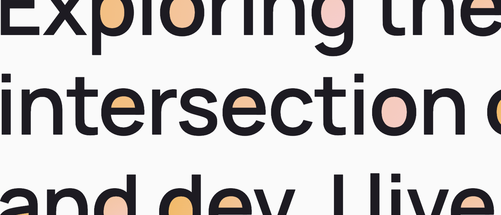

# counter-fill
Fills the enclosed counter spaces inside letterforms — the holes in **o, e, a, g, d, b, p** — with any colour or gradient.



| | |
|---|---|
| **Role** | Author |
| **Type** | Script / Experiment |
| **Status** | WIP · 2025 |
| **Tags** | canvas · typography · experiment · open-source |

## Overview

Fully generative. Works on any word, any font, any size. No hardcoded letterforms. Real DOM text — accessible, selectable, screen-readable.

The idea: draw the text onto an offscreen canvas, flood-fill from every edge to mark all *outside* transparent pixels, then treat whatever unmarked transparent pixels remain as counter holes. Paint those with a radial gradient. Put the canvas behind the real text so the text stays selectable and the effect stays invisible to assistive technology.

The result is letterforms that glow from the inside — the holes in **o**, **e**, **a**, **g**, **d**, **b**, **p** and **q** lit up with colour while the strokes remain unchanged.

## The Constraint

Most typographic fill effects require SVG paths, custom letterforms, or image exports. None of those are accessible, resizable without re-exporting, or font-agnostic. The constraint here was to work entirely with real DOM text — no SVGs, no images, no pre-baked paths — so the result is still readable by screen readers, selectable by users, and font-agnostic by default.

## Approach

### BFS flood-fill from the canvas edges

Text is drawn white on transparent onto an offscreen canvas. A BFS flood-fill starts from every edge pixel — any transparent pixel reachable from the edge is "outside." Any transparent pixel that remains after the flood is enclosed: a counter hole.

### Drift correction

Canvas `textBaseline` and DOM layout don't always agree. A probe canvas measures where the ink actually lands, compares it against the expected baseline, and corrects the offset before drawing to the main canvas. This keeps the fill aligned to the real rendered glyphs on every browser and screen density.

### Dilation

Counter pixels are dilated 2px outward before painting to close antialiasing gaps. The text span sits above the canvas via `z-index`, so the slight bleed is hidden by the strokes themselves.

### Multi-line support

In multi-line mode, the library splits words into individual `span.cf-word` elements, measures each word's baseline position via a zero-width sizer span, and draws all words onto a single shared canvas. This keeps the gradient coherent across line breaks.

### Performance

A `ResizeObserver` watches all target elements. Repaints are debounced via `requestAnimationFrame` and skip elements whose pixel dimensions haven't changed, so resize events on retina screens don't trigger redundant BFS passes.

## Use It

```html
<!-- Single word -->
<h1 class="wrap" id="my-heading">
  <canvas></canvas>
  <span class="text">Golden</span>
</h1>

<!-- Multi-line — JS splits words automatically -->
<h2 class="wrap-multi" id="my-multi">Golden Baroque Obsidian</h2>

<script src="counter-fill.js"></script>
<script>
  document.fonts.ready.then(() => {
    CounterFill.init({
      'my-heading': { stops: ['#f5c842', '#d4820a', '#7a3a08'] },
      'my-multi':   { stops: ['#f5c842', '#d4820a', '#7a3a08'] },
    });
  });
</script>
```

[View standalone demo](/counter-fill.html) · [Source on GitHub](https://github.com/jacquesramphal/jacquesramphal.github.io/tree/main/scripts)

## What I Learned

BFS flood-fill on a canvas is fast enough for display-size text on a modern device, but the GPU-to-CPU readback (`getImageData`) is the bottleneck. Running it on a probe canvas first, then using that result to correct the main canvas position, keeps the expensive readback to one call per element.

The bigger surprise was how much browser-to-browser variance there is in where text actually lands relative to its declared baseline. The drift correction pass turned out to be necessary, not optional.
