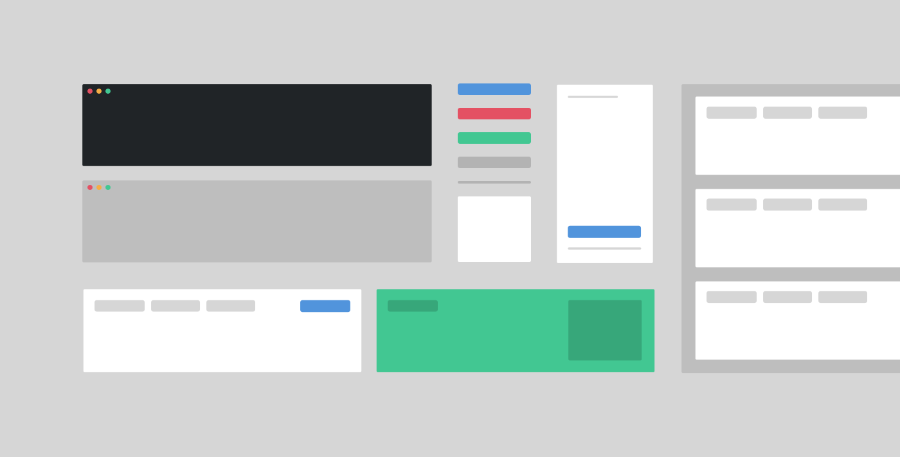
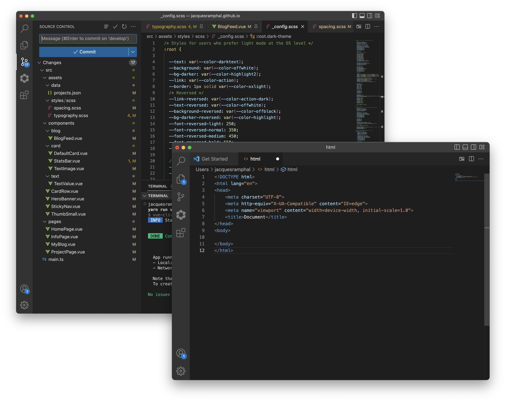
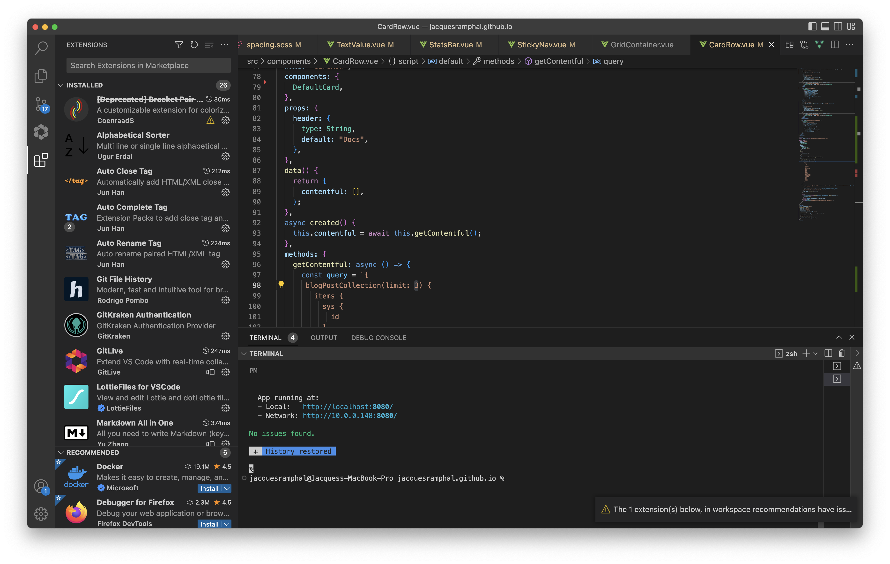
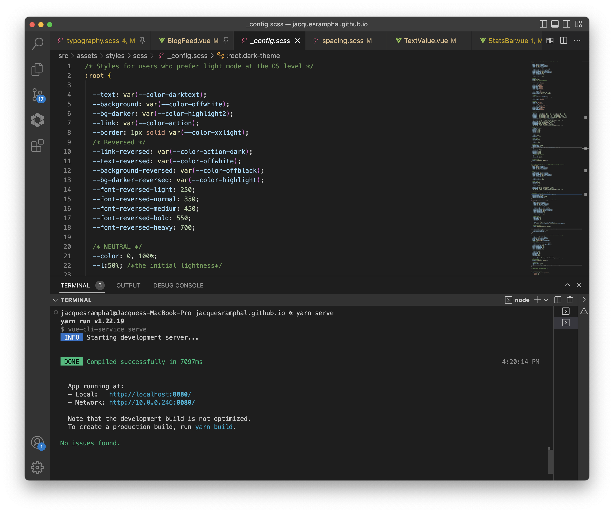
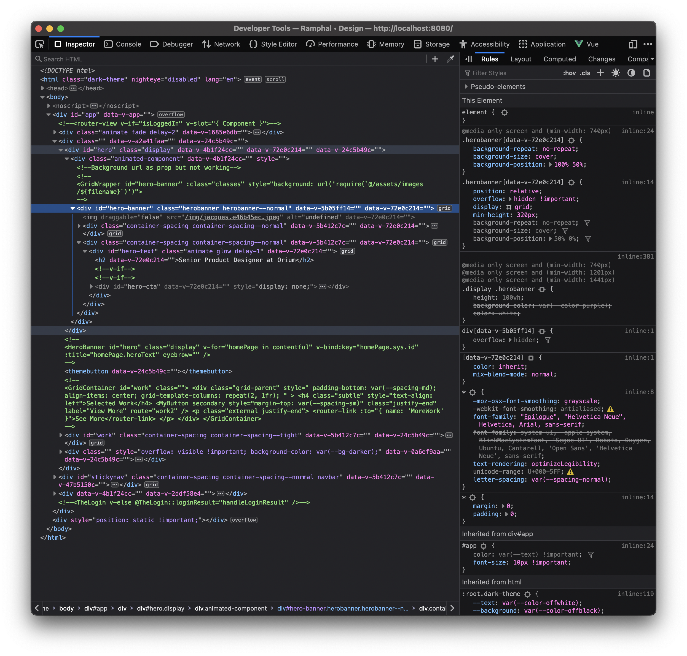
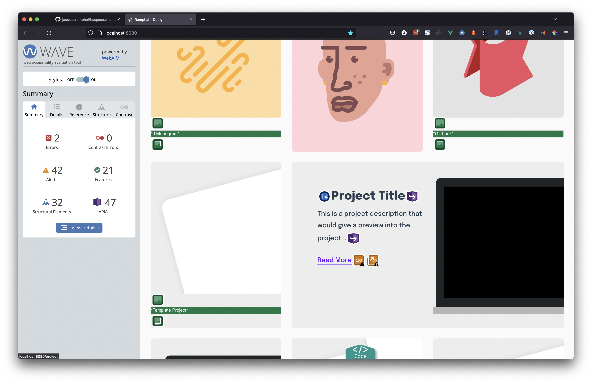
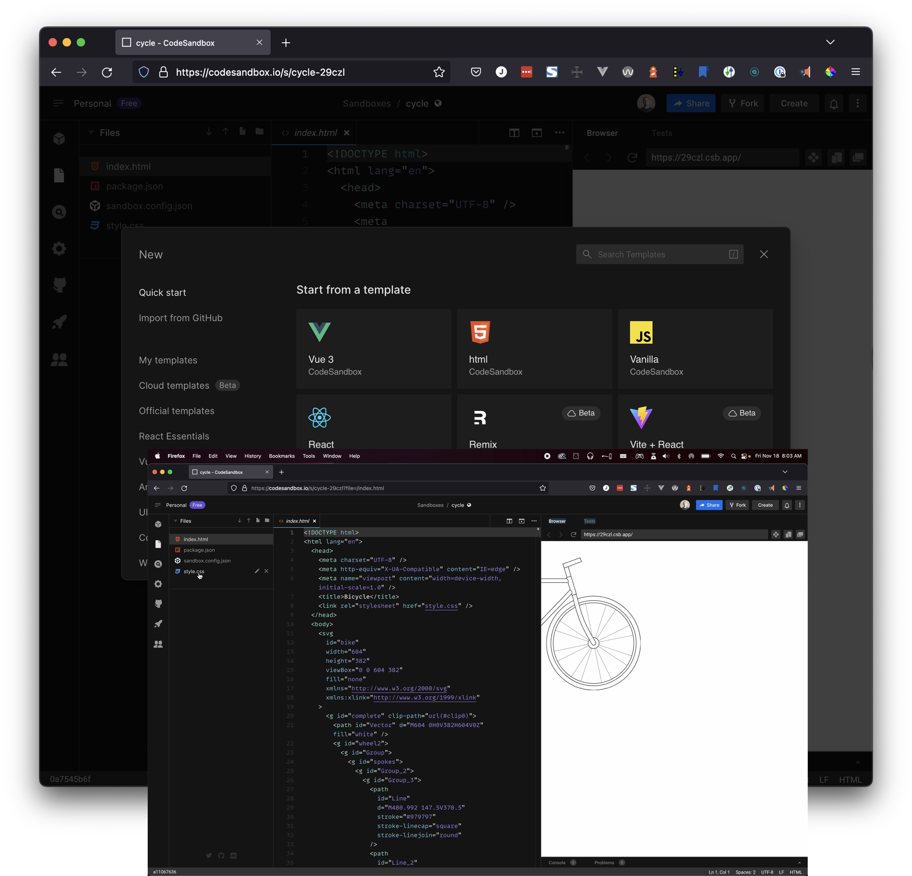

# The Future-Proof Toolkit for Front-end Design
The Ramstack. Essential tools and resources for front-end design.

Tags Tags Tags

##### Notes
- currently need to remove the tools from the list to ensure this is actually future proof
- instead of "use vscode" say, use an editor that supports XYZ
- instead of use netlify
- instead of a bunch of plugins, ensure the core of your app is self sufficient and deosnt include excessive dependencies

====== TMP ======

Currently knee-deep in the sea of design tools, much like we've always been, we realize that the current industry standard file format is just a pitstop on the journey – a tool bound to be succeeded by something else down the line. It's a matter of time before we navigate a new terrain, and design tools become a stepping stone in the ongoing design evolution.

Figma, with all its versatile features like auto layout, pinning, and plugin workflows rooted in web standards, presents a double-edged sword. Despite its strengths, it brings along compatibility challenges – these features are not universal, causing snags in our designs when eventually transitioning across different design tools. 

#### The Universal Goal

Will there be a day when the designer and developer environments are one and the same? Imagine designing right there in the browser. Complete, production-ready front-end code from inception. Figma seems to be nudging us in that direction, with developer-friendly features, dev modes, and improved naming conventions aligning with different coding languages, but can we envision a future where these distinctions disappear? When we transcend the limitations of feature sets, and embrace a future where the product design landscape converges into a unified, universally compatible platform.

#### Bridging the gap(s)

So, how do we bridge the gap and make our designs as flexible as pencil and paper? As interoperable as code? Can we break free from the constraints of design tools, dictating what we can and cannot do with our ideas? Designing directly in the browser might be the answer, but the learning curve could be a hurdle not all of us are ready to tackle.

Builder.io takes a swing at this concept, allowing us to design in the browser with custom components from our codebase. But, of course, it's just another tool in the toolbox. Developers have their arsenal too – Visual Studio Code, GitHub – but the key difference is flexibility. Code can be manipulated in both complex and simple programs, and is less likely to become obsolete (check back in 5 years and see if this is still true).

====== TMP ======

---

## 0. Overview
### Headless Complexity
- With the domination of headless architectures, there seems to be a tool for everything. The tool for X and another tool for Y. Endless integrations and microservices all playing together to form the complexity that is a modern application.
- While this is most certainly good in many ways, it brings about a slippery slope, in which our products can be made infinitely more complex -- more tools more dependencies. 
- What I's saying is, headless can get messy.

### Interoperability

- Often we strive to get one tool to rule them all. The low code builder that respects both designer's and developer's wishes, can handle complex prototyping, export to code, gather feedback and serve as a handoff tool for developers.
- We are trying to avoid a messy toolbox, but we can’t always find that one tool to do everything AND do it well.
- Inevitably Our tools become outdated
- The next industry standard file type takes over.
- Workflows are replaced with more efficient ones.
- AI changes the paradigm.
- The trick is making sure the core of what we are doing is interoperable -- agnostic of toolchain.
- We should aim to reduce tools to what we really need. 
- Find tools that do more than one thing well, are backed by a community, work well with change. Or ignore them all together.

#### The Ramstack

Javascript, API, Markdown (Jamstack) is a headless approach to web architecture. With an emphasis on flexibility, scalability, performance and maintainability, Jamstack removes the need for business logic to dictate the web experience.

The following is my recommended suite of Jamstack tools. This list is everything but comprehensive. My personal toolkit for front end design (the Ramstack) broken down into 4 essential buckets:

- Write
- Store
- Serve
- Debug & Test

---
## 1. Write: VScode
VS Code is a lightweight source code editor with built in language support and a rich community of plugins and workflow tools
[https://code.visualstudio.com/download](https://code.visualstudio.com/download)

- Integrated Terminal
- Plugins
- Source Control

#### Write Clean Code

- VS Code is a lightweight source code editor 
- Extensive built in support for all languages and frameworks
- Rich ecosystem of plugins and workflow tools
- Quick templates

#### Plugins

- Extensions let you add languages, debuggers, and endlessly useful tools to your workflow.
- Auto complete, linting tools, etc. can help support you as you learn to code.

#### Integrated Terminal

- VS Code conveniently includes a full featured integrated terminal that starts at the root of your workspace.
- Terminal is a text input and output environment. Allows us to enter commands that the computer processes.

---
## 2. Store: Git
An acronym for Global Information Tracker. A Git Repo tracks all changes made to files in your project, building a history over time.

#### Store & Manage Code

- Cloud storage, version control
- Work on a local version of your files and never lose changes/progress
- Keeps your live site safe
- Give others access, ask for help

#### Pull Requests & Merging
Pull requests let you tell others about changes you've pushed to a branch in a repository on GitHub. Once a pull request is opened, you can discuss and review the potential changes with collaborators and add follow-up commits before your changes are merged into the base branch.

- Document changes you’ve pushed to a branch
- Discuss and review with collaborators before merging

#### Diff Tools

- Examine before and after states
- Spot regressions and bugs
- Preview changes

---
## 3. Serve
Storing, serving, and maintaining files for one or more Web sites.

#### Github Pages
The purpose of GitHub Pages is to provide the GitHub user a way to create personal websites for themselves and websites for their projects / repositories. For each registered GitHub account (representing a user or an organization) you can register one User Page, but an unlimited Project pages.

- Free hosting on Github
- Custom Domains
- Simple setup
- Continuous integration with actions
#### Netlify
Netlify is an all-in-one platform for automating modern web projects. Replace your hosting infrastructure, continuous integration, and deployment pipeline with a single workflow. Integrate dynamic functionality like serverless functions, user authentication, and form handling as your projects grow.

---
## 4. Debug & Test

- Create, test and debug
- Integrated in browser
- Inspect sites

Create, test and debug software. 

- Browser integrated developer tools, which allow to inspect a website

### Developer Tools
#### Inspect Tools

- Examine, edit, and debug HTML, CSS, and JavaScript
- View and edit page content and layout  
    (box model, animations, and grid layouts)
- See messages logged by a web page and interact with the page using JavaScript.
- Figure out how others have solved certain problems
- See how your website or app will look and behave on different devices and network types.

[https://firefox-source-docs.mozilla.org/devtools-user/](https://firefox-source-docs.mozilla.org/devtools-user/)

[https://developer.chrome.com/docs/devtools/](https://developer.chrome.com/docs/devtools/)

<blockquote>Caveat: SSG abstract front end code. JS is written one way and the browser may render a site in a different way. Outputs HTML vs the original code</blockquote>

#### Wave Accessibility Plugins

- Wave Plugin
- Contrast Ratios

[https://addons.mozilla.org/wave-accessibility-tool/](https://addons.mozilla.org/en-CA/firefox/addon/wave-accessibility-tool/)

[https://chrome.google.com/wave-evaluation-tool/](https://chrome.google.com/webstore/detail/wave-evaluation-tool/jbbplnpkjmmeebjpijfedlgcdilocofh)

---
## Bonus Section

### Online Environments

#### CodeSandbox, Codepen

CodeSandbox is an online code editor and prototyping tool that makes creating and sharing web apps faster.

1. Accelerated testing
2. Online playground
3. Starter templates

- Online code editor and prototyping tool that makes creating and sharing web apps faster 
- Starter Templates
- Rapid Prototyping 
- Knowledge sharing
- Better feedback

