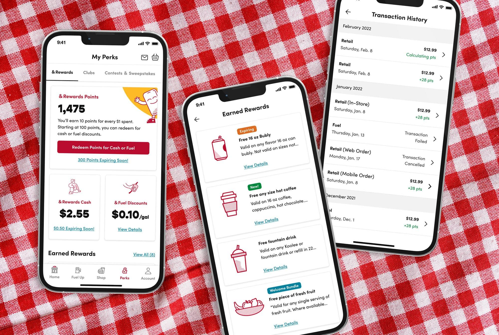

<header>

# K&G Loyalty Platform: Redefining Convenience Through Digital Experience

#### Building a mobile-first loyalty platform that connects digital convenience with in-store experiences.

</header>

## The Challenge: Modern Convenience Needs Modern Tools

Founded in 1959, Kum & Go has been redefining convenience retail for over 60 years. But by 2020, their digital experience wasn't keeping pace with customer expectations. The mobile app needed to evolve from a basic utility into a platform that could drive engagement, loyalty, and seamless omnichannel experiences.

**The core challenge:** How do you build a digital experience that enhances—rather than replaces—the convenience store experience? How do you create a loyalty program that feels valuable, not transactional?

### The Business Problem

Kum & Go wanted to upgrade their digital experience to better serve their customers, but they faced several constraints:

- **Legacy Platform Limitations** — The existing system was costly to maintain and difficult to extend
- **Fragmented Customer Experience** — Search, merchandising, promotions, and loyalty were disconnected
- **Limited Engagement** — The current loyalty program wasn't engaging a large enough segment of customers
- **Omnichannel Gap** — Digital and in-store experiences felt separate, not integrated

Most importantly, they needed a platform that could adapt and evolve without service disruptions. This wasn't just a redesign—it was a complete platform transformation.

## The Solution: A Composable, Scalable Architecture

To solve these challenges, we partnered with Kum & Go to build a flexible, scalable platform focused on four key objectives:

### 1. Control Over Digital Experience

Kum & Go needed to manage their digital presence independently—search, merchandising, promotions, loyalty, and content all needed to be in their control. This meant building a platform where marketing teams could make changes without waiting for development cycles.

### 2. Increased Customer Engagement

A robust loyalty program was essential, but it needed to feel valuable and engaging, not just transactional. The goal was to create a program that customers actually wanted to use, not just signed up for.

### 3. More In-Store Purchases

The digital experience shouldn't compete with in-store—it should enhance it. We needed to create an omnichannel experience that drove customers to physical locations while providing digital convenience.

### 4. Extensible and Maintainable Platform

Moving off the legacy platform required building something that was both modern and sustainable. The new platform needed to be efficient, innovative, and adaptable for future needs.

## The Technical Approach: Composable Architecture

We built the platform using a composable architecture that gave Kum & Go flexibility and control:

### React Native for Mobile

We leveraged Orium's React Native Accelerator to build a cross-platform mobile app that works seamlessly on both iOS and Android. This approach allowed us to maintain a single codebase while delivering native experiences.

### Contentful for Content Management

Contentful's composable content platform gave Kum & Go's marketing team the ability to manage content, promotions, and merchandising without developer intervention. This was crucial for the "control over digital experience" objective.

### Typesense for Search

Typesense provided fast, relevant search and product indexing. Customers could quickly find what they were looking for, whether it was a specific product, a promotion, or a nearby location.

### Paytronix for Loyalty

Paytronix was chosen to manage the comprehensive loyalty program, handling promotions, ordering capabilities, and point redemption. This integration was key to creating an engaging loyalty experience.

### P97 Integration for Mobile Fuel Pay

Integration with P97 enhanced the Mobile Fuel Pay feature, allowing customers to prepay for gas in selected increments and redeem points directly at the pump. This bridged the digital and physical experience in a meaningful way.

## The Outcomes: A Platform That Delivers

The revamped Kum & Go mobile app launched with significant improvements across all four objectives:

### Enhanced Loyalty Program

The new rewards program was more engaging and valuable. Customers could easily track points, redeem rewards, and discover new ways to earn—creating a more active, engaged user base.

### Personalized Experience

The app featured a personalized interface that adapted to customer preferences, home location selection for quick access to nearby stores, and customer history-based recommendations that made shopping more convenient.

### Improved Mobile Fuel Pay

The Mobile Fuel Pay feature was enhanced to allow customers to prepay for gas in selected increments, creating a seamless experience from app to pump. This integration of digital and physical experiences was a key differentiator.

### Platform for Growth

The new platform wasn't just a one-time launch—it was built to evolve. Kum & Go now has a foundation they can extend and enhance as customer needs change, without the constraints of legacy systems.

## What This Project Taught Me

This project reinforced a fundamental truth about digital transformation: **the best digital experiences don't replace physical ones—they enhance them.**

Building a loyalty platform isn't just about points and rewards. It's about creating a relationship between brand and customer that spans digital and physical touchpoints. The Mobile Fuel Pay integration was a perfect example—it took a digital action (prepaying for gas) and made it meaningful in the physical world (at the pump).

**The technical lesson:** Composable architecture isn't just a buzzword. When you build with composable principles—separating content, commerce, search, and loyalty into independent systems—you create flexibility that pays dividends. Kum & Go can now evolve each part of their platform independently, without breaking the whole system.

**The design lesson:** Omnichannel experiences require thinking beyond screens. The most impactful features were the ones that connected digital actions to physical outcomes—prepaying for gas, earning points at the pump, using the app to enhance the in-store experience.

This project also taught me the value of working with specialized partners. We didn't build everything from scratch—we integrated best-in-class solutions (Contentful, Typesense, Paytronix, P97) to create a platform that was both powerful and maintainable. Sometimes the best architecture is knowing what to build and what to integrate.

## Looking Forward

Kum & Go continues to enhance the mobile app and is redesigning the web experience to match the new mobile features. The platform we built gives them the foundation to evolve and adapt as customer expectations change.

The success of this project wasn't just in the launch—it was in creating a system that Kum & Go can grow with, extend, and refine over time. That's the real value of a well-architected platform.

**Jacques Ramphal**  
*Lead Product Designer & Front-end Developer | Orium*

---

**Project Links:**
- Download the app (US only): https://kumandgo.com/download
- Visit site: https://kumandgo.com/
