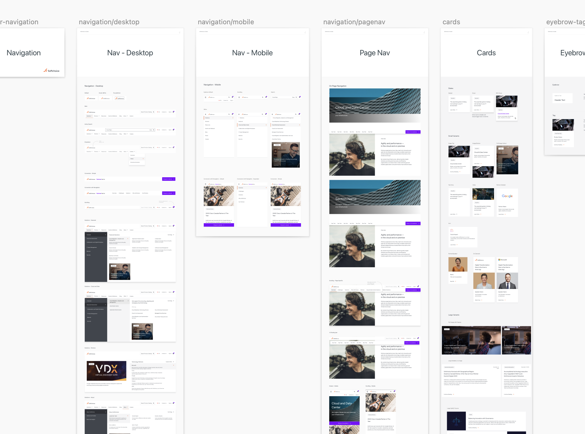

<header>

# Softchoice Website Rebrand: Polishing a Brand Identity in Motion

#### When a brand launches a new identity, the website needs to reflect it—without breaking what already works.

</header>

## The Challenge: A Brand Launch Without Breaking the Foundation

In late 2020, Softchoice was preparing to launch a new brand identity in January. Their website, built on an interim design from August 2020, had incomplete design elements and wasn’t ready to represent the new brand. The challenge wasn’t just visual—it was about enhancing the experience while respecting the existing CMS architecture that was already serving the organization well.

**The constraint:** We couldn’t rebuild the site. We had to work within the established module-driven CMS structure, enhancing and polishing without disrupting what was already functioning.

This is a common scenario in enterprise work: **you’re not starting from scratch. You’re improving what exists while respecting the systems already in place.**

## The Approach: Module-Driven Enhancement

Rather than tearing down and rebuilding, we took a surgical approach: **redesign the modules, not the system.**

### Brand Guidelines as the Foundation

The new brand guidelines were comprehensive—colors, typography, spacing, imagery principles. Our first step was to understand how these guidelines could translate into the existing module structure.

### Module Redesign Strategy

The CMS was built on a block model approach. Key modules included:
- Hero sections
- Page navigation
- Two-column layouts
- Callouts and stats
- Image quadrants
- Text quadrants
- Related content sections
- Accordions

Each module needed to be redesigned to reflect the new brand while maintaining its functional purpose. This wasn’t about changing what the modules did—it was about how they looked and felt.

### Auto-Generated Pages: The Hidden Complexity

Beyond the manually curated pages, Softchoice had auto-generated and templated pages that needed attention:
- Resource Center
- Blog listings and detail pages
- Events pages
- Newsroom
- Partners Home

These pages were generated by the CMS, but they still needed to reflect the new brand. This required designing layouts and wireframes that the CMS could populate consistently.

### The Homepage: Where It All Comes Together

The homepage is always special. It’s the first impression, the entry point, the place where brand identity needs to shine. We selectively redesigned the homepage layout while maintaining its module-driven nature—ensuring it felt cohesive and polished without requiring a complete rebuild.

## Motion Design: Bringing Life to the Interface

One of the most impactful additions was introducing light animations and motion design. This wasn’t about flashy effects—it was about enhancing the user experience through thoughtful motion:

- **Navigation behavior** — Smooth transitions that guide the eye
- **Module loading** — Content appears in a way that feels intentional, not jarring
- **Text appearance on scroll** — Information reveals itself naturally as users explore
- **Interactive navigation buttons** — Feedback that makes the interface feel responsive

Motion design, when done right, doesn’t call attention to itself. It makes the interface feel more polished, more intentional, more alive. It’s the difference between a static brochure and a living website.

## Developer Collaboration: Making It Real

Design is only as good as its implementation. For this project, that meant creating detailed specs and guidelines for the development team:

- **Margin sizes and spacing** — Exact pixel values for consistency
- **Component specifications** — Clear definitions of how modules should behave
- **Image guidance** — When to use overlays, masks, vector vs. photography
- **Ongoing support** — Being available during implementation to answer questions and make adjustments

The handoff wasn’t just a design file. It was an ongoing collaboration to ensure design fidelity while respecting technical constraints.

## The Outcomes: A Cohesive Brand Experience

The rebrand wasn’t just about new colors and fonts. It was about creating a cohesive experience that reflected Softchoice’s new brand identity across every touchpoint.

### Consistent Brand Identity

The website now fully reflects Softchoice’s new brand identity. Every module, every page, every interaction feels like it belongs to the same visual language. This consistency builds trust and reinforces brand recognition.

### Enhanced User Experience

The thoughtful module redesign and light animations created a more engaging and intuitive interface. Users don’t notice the individual improvements—they just feel that the site is more polished, more professional, more aligned with what they expect from Softchoice.

### Efficient Development Process

Clear specifications and ongoing collaboration meant the development team could implement the design accurately without constant back-and-forth. The detailed guidelines reduced ambiguity and sped up the implementation phase.

### Collaborative Success

This project required coordination between multiple parties: the design partner (us), the branding agency that created the new identity, and Softchoice’s internal IT team. The success came from everyone understanding their role and working together toward a shared vision.

## What This Project Taught Me

Working within constraints—whether they’re technical, timeline, or budget-related—forces you to be more creative, not less. We couldn’t rebuild everything, so we had to be strategic about what to enhance and how to enhance it.

**The lesson:** Sometimes the best design work happens when you’re improving what exists rather than starting from scratch. It requires a different kind of creativity—one that sees potential in constraints and finds elegant solutions within established systems.

This rebranding effort modernized Softchoice’s online presence while respecting the foundation that was already working. It’s a reminder that great design isn’t always about the biggest changes—it’s about the thoughtful improvements that make everything feel cohesive and intentional.

**Jacques Ramphal**  
*Senior Product Designer | Orium*
