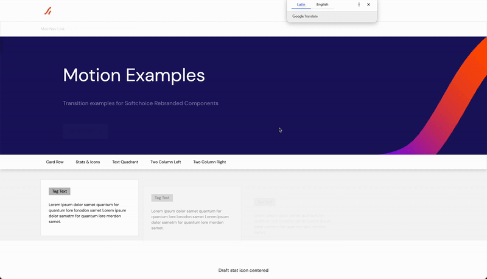

# Case Study: Softchoice Website Rebrand Project
### The Problem

Softchoice needed to rebrand their website to reflect a new brand identity launching in January. The current site, based on an "interim" design from August 2020, had incomplete design elements, resulting in suboptimal user experience (UX). The challenge was to enhance and polish the website design using the new brand guidelines without altering the existing CMS structure and navigation.

### The Solution/Strategy

Design and Strategy Implementation:

- **Brand Guidelines Integration:** Leveraged detailed brand guidelines to rebrand and redesign the website, ensuring consistency with the new brand identity.
- **Module-Driven Redesign:** Focused on redesigning the modules within the CMS framework without altering the established block model approach. Key modules included Hero, Page Nav, Two Columns, Callouts, Stats or Icons, Image Quadrant, Text Quadrant, Related, Text Columns, and Accordion.
- **Auto-Generated Page Redesign:** Redesigned auto-generated and templated pages, such as the Resource Center, Blog, Events, Newsroom, and Partners Home, incorporating new layouts and wireframes as needed.
- **Home Page Enhancement:** Given the homepage's significance, selectively redesigned its layout while maintaining its module-driven nature.
- **Image Library Compliance:** Provided guidance on overlay and mask additions, vector image vs. photography usage, and optionally sourced and edited images to fit the new brand design.
- **Motion Design:** Introduced light animations to enhance UX, focusing on navigation behavior, module loading, text appearance on scroll, and interactive navigation buttons.
- **Developer Collaboration:** Created detailed specs and guidelines for developers, including margin sizes, spacing, and pixel values. Provided ongoing support during the implementation phase and assisted in final QA/UAT to ensure design fidelity.

### The Outcomes
- **Consistent Brand Identity:** The website now fully reflects Softchoice's new brand identity, providing a cohesive and polished visual experience.
- **Enhanced User Experience:** Improved design elements and UX through thoughtful module redesign and light animations, resulting in a more engaging and intuitive user interface.
- **Efficient Development Process:** Clear and detailed design specifications facilitated a smooth handoff to the internal development team, ensuring accurate implementation.
- **Collaborative Success:** Close collaboration between the design partner, branding agency, and internal IT team led to a successful project completion with all design objectives met.

This rebranding effort not only modernized Softchoice's online presence but also significantly improved the overall user experience, aligning the website with the company's new brand vision.