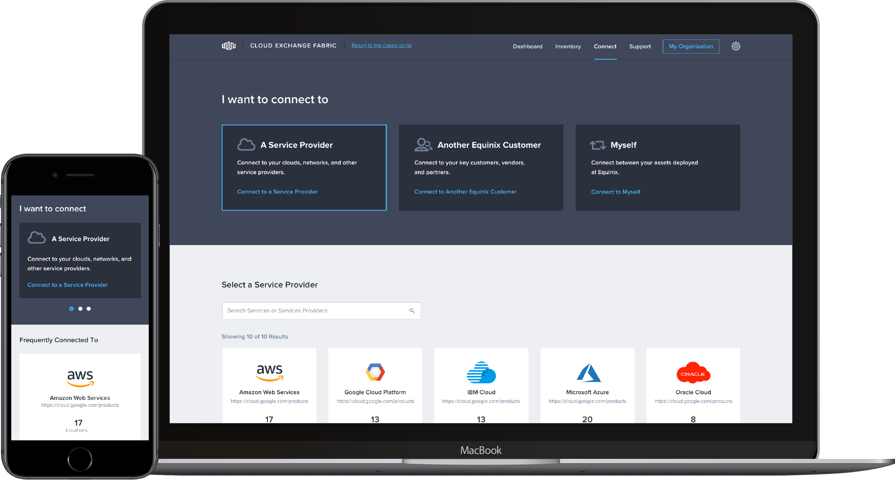
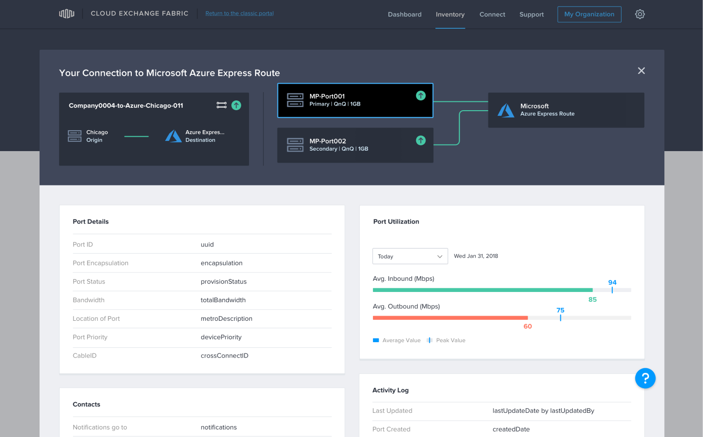
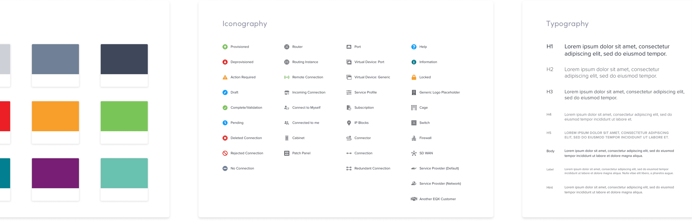
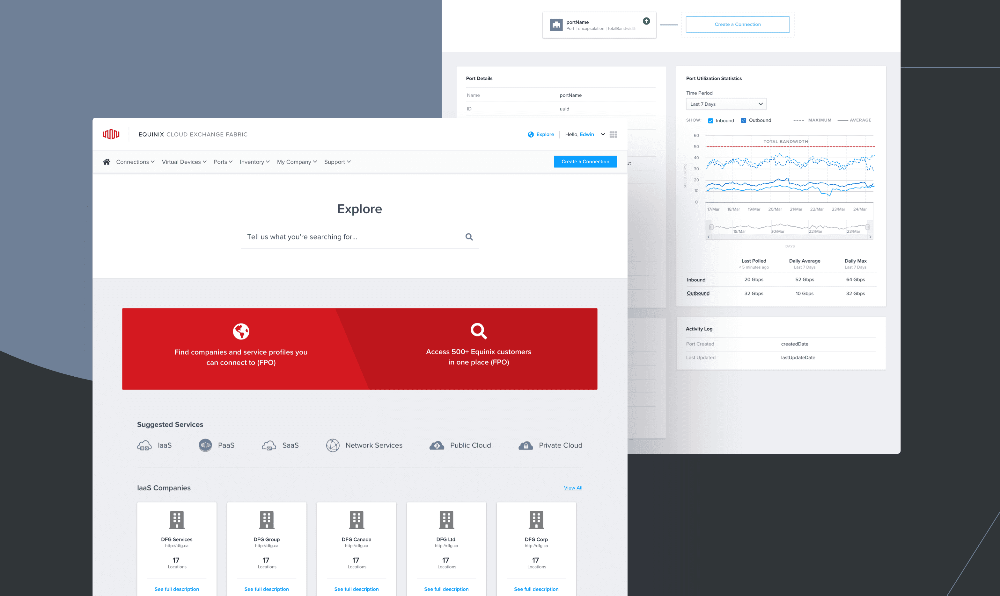

<header>

# Case Study: EQX Interconnection

</header>

## The Problem
The Challenge
Reimagine the user experience for the next generation of interconnection services; design and develop a marketplace that facilitates the discovery and connection of cloud services.

## The Strategy
The Strategy
Qualitative interviews with different portal user groups; new modular & component-based codebase; prototyping and testing with main user groups (buyers, sellers, and resellers).

**REWRITE**

We worked to create a system that would highlight the most important elements, making them easier for users to find. We introduced network topology diagrams that offer clear visual pictures of network setups and allowed our development team to deal with data sets containing over 100,000 pieces of data. This elegant solution integrated with their API to bring meaningful insights, not just more information, to users. With a more user-friendly format for understanding their networks and navigating the portal, Orium created a more digestible and enjoyable experience for Equinix users.

## The Outcomes
The Solution
A React.js platform supplemented by a pattern library that can be built and expanded upon; a new user experience team and user experience strategy.

### A comprehensive style guide for an array of Equinix products.

And across all three properties, our team worked with the client team to build and bolster their design standards and practices. With the aim of building lasting solutions, we worked with them to establish everything from icon libraries to repeatable design patterns that could be applied across the engagements we worked on with them, as well as on any future projects.

