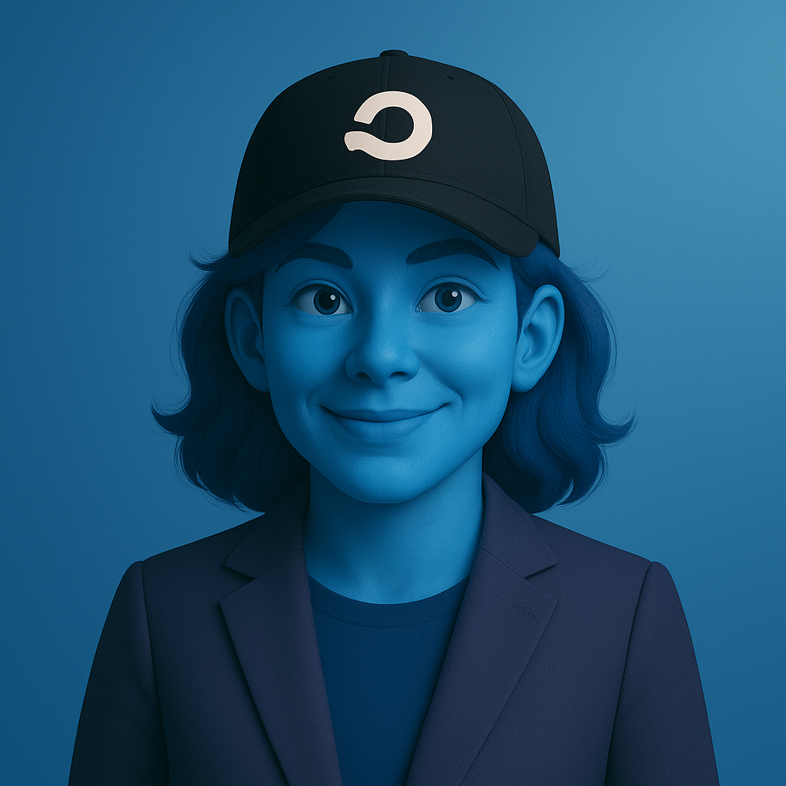

# Building Genie didn’t just change how we work. It changed me.

#### This is the story of building Genie—from personal experiment to organizational platform—and the three mental model problems we had to solve to design for agentic AI.

## What is Genie?
For the past year or so, I’ve been working on [an internal tool at Orium, called Genie](https://orium.com/blog/orium-genie-agentic-ai-design), that is redefining how we approach our projects and client work. But before I tell you the story of why we built Genie, what the journey was like, and how it has impacted not just my day-to-day workflows, but my perception of work, you need to understand what Genie actually is.

Genie is an agentic orchestration layer for delivery operations. It connects to live project systems like Jira, Slack, Mavenlink, and internal project databases, continuously synthesizing context, surfacing insights, and automating workflows without manual intervention.

The simplest way to think about it is this: **Genie is what happens when you give an agent access to your operational data, and the ability to take action.**

But Genie didn’t start as a platform. It started as a way for me to protect the part of my work I cared about most.

## Reclaiming Creative Focus
My work was evolving, and so was the industry around me. I found myself moving constantly between design systems, audits, requirements, and component mapping. Across projects, the pattern was always the same: gather information from a dozen places, shape it into user stories, rebuild requirements I’d written versions of before, run familiar audits, and assemble design backlogs that would inevitably shift once the project got moving.

None of that work was wasted, but it consumed energy I wanted to spend elsewhere. Every hour spent on routine, mechanical tasks was an hour not spent on judgment, insight, or problem-solving— the creative core of design.

So my thinking shifted. What if the predictable parts of the work could be automated? Could I reclaim space for the work that actually moves projects forward?

The challenge wasn’t about working harder or improving time management or trying to do more work. It was about protecting creative focus so I could do better work.

## A Personal Experiment That Got Out of Hand
I started experimenting in small pockets of time. Thirty minutes between design reviews or an hour on a Friday evening playing with small automations, custom GPTs, and scripts that could run audits, generate user stories, and map components.

I was learning tools I’d never touched before—[N8n](https://n8n.io/), workflow orchestration, agentic AI patterns—to solve problems I’d never encountered before. I had to learn AI development properly and truly understand how agents work, because I was building one to solve real design problems. Curiosity turned into a passion project, and an education I hadn’t planned on.

I showed some of the experiments to the team and the questions came quickly. Could Genie run this audit for us? Could it generate user stories for our scope? Could it help with component mapping?

It turned out my problems weren’t unique. Every designer was spending creative energy on routine tasks when they could be solving novel challenges. What started as personal reclamation could become organizational reclamation.

## From Personal Tool to Product
Building Genie as an experiment for myself was one thing. Scaling it for an entire team was something else entirely— and it meant not only that Genie had to become something new, but that I did, too.

Not entirely new— I didn’t stop being a designer. I was still in the trenches, shipping features, gathering feedback, making tradeoffs. But I had to learn product thinking by building for other designers, not just myself. I had to learn how to lead without formal authority. How to champion a vision while remaining an individual contributor. How to collaborate, distribute work, and make decisions that affected people with very different workflows and concerns.

When I brought Genie to leadership, they saw what I was beginning to understand: this wasn’t just a productivity tool, it could change what kind of work we focus on. Instead of spending time on routine and mechanical tasks, we could invest energy in the novel, strategic work our clients actually value.

So I pitched the vision. A supervisor agent with access to design and project data. An orchestration layer capable of running audits, generating requirements, recognizing design patterns, surfacing insights in real time. A system that freed designers to focus on user problems that actually require human judgment.

Building toward that vision meant going deep into things I didn’t fully understand. Complex integrations and hard decisions about what should be automated and what should remain human-centered. It was all new technical territory that designers aren’t usually expected to navigate.

I had to learn when to admit I didn’t know enough and ask for help, and when to accept that some problems were bigger than my current expertise.

Building Genie at scale taught me that the best builders are comfortable not knowing everything. They know when to wrestle with hard problems, and when to say, “This needs a different way of thinking.”

I was rebuilding my own skillset in real time.

I became an AI developer. A workflow orchestration practitioner. A product thinker. A designer who builds agent systems and understands the intersection of design, development, and AI.
But most importantly, I stayed a designer. Genie didn’t pull me away from what I love. It gave me back the time and creative energy to focus on it.

That’s the real story of Genie. Not just what I built, but what building it made me capable of. And what it enabled us to do as a team.

## Building a Product, Rebuilding Yourself
Building Genie from a personal tool into an organizational platform reinforced something I believe deeply now. The fastest way to grow is to solve real problems at scale.

You don’t become an AI developer by taking courses, you become one by building something that forces you to understand how agents actually work. You don’t become a product manager by reading frameworks, you become one by making hard tradeoffs and listening to real feedback.

For me, a few lessons stand out:

1. Real growth comes from real problems. If something frustrates you enough, experiment. Constraints force learning in a way theory never will.
2. You can lead while staying close to the work. Being a strong individual contributor doesn’t disqualify you from leadership. It often makes you better at it.
3. Building at scale requires knowing when to go deep and when to step back. That tension never goes away, and learning to live with it is part of the job.

The most meaningful projects serve your team and your own growth at the same time. That overlap is rare, but it’s where real transformation happens.

## The Hardest Part: Building for Others
The simple truth most people won’t admit: Having a good idea is actually the easy part. Convincing exhausted teams to adopt something new is what’s hard.

Teams are already stretched, and when we ask them to learn new tools, change workflows, and trust an agent with requirements they used to own, some people are curious, but as many or more are skeptical or simply too tired.

That means not everyone will adopt a new solution immediately. Worries about losing human connection to the work, or trusting an agent understands what’s needed, or fears of what automation implies hold people back. And it’s important that we understand these as legitimate concerns, coming directly from the people doing the hard work.

When I built Genie for myself, I could move fast. Building for others meant listening, slowing down, and accepting that usefulness isn’t universal by default. It has to be earned.

Some days are hard, when it feels like nobody gets it and adoption is painfully slow. 

And then other days a team tells me Genie saved them hours, helped them catch something they would have missed, or gave them space to focus on what they care about.

And both of those kinds of days—and all the ones in between—are the messy reality of building something real. It’s never all one or the other.

Real impact isn’t about being right. It’s about understanding why people resist, what they’re afraid of, and creating something that actually addresses those fears. Building something meaningful changes not just your work, but your role, your expectations, and the way others engage with you.

## When Serious Questions Are a Privilege
I get a lot of feedback now about product management. Do you have a vision document? A roadmap? Success metrics? Artifacts?

When you’re deep in the work, unblocking issues and shipping features, those questions can feel jarring. You’re making real progress. Why does this stuff matter right now?
The perspective shift that helped me was simple.

You don’t get asked those questions unless what you’ve built matters.

Those are questions for serious tools, not side projects. They’re not criticism. They’re signals that you crossed a threshold.

The irony isn’t lost on me. I might be a strong designer and a capable developer, but I’m a junior product manager. And that’s actually a compliment. It means Genie outgrew me as a personal tool and became something that requires product thinking.

When someone asks for a vision or a roadmap, they’re saying this matters enough to think about strategically.

That’s what Genie is teaching me. Building something meaningful changes not just your work, but your role, your expectations, and the way others engage with you.

And that’s uncomfortable. And humbling. And exactly where growth happens.
Building Genie didn’t just change how we work. It changed what I’m capable of building next.
