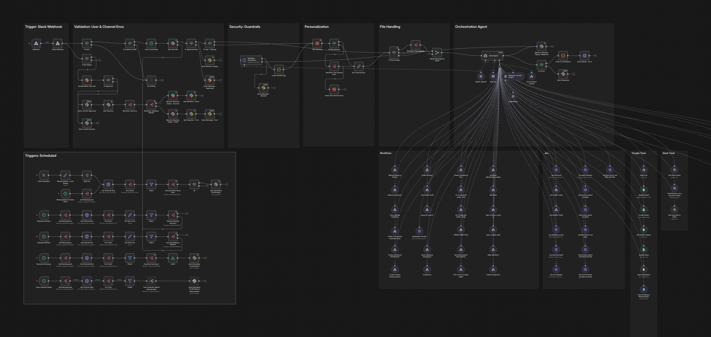

# Designing Genie
An agentic orchestration layer for design delivery — built to automate routine work so the team could focus on the kind that actually requires a person.

| | |
|---|---|
| **Role** | Lead Designer · Product |
| **Client** | Internal / Orium |
| **Status** | In Progress · 2024 |
| **Tags** | ai · agentic-ai · product |

## Key Learning

The design challenge in agentic AI isn't the interface — it's making the reasoning visible enough that a designer can validate, override, or redirect an output without needing to understand the underlying model.

## Overview

Routine delivery work — user stories, audits, component mapping, requirements — was consuming the time and energy that should have gone toward design problems worth solving.

Every project at Orium moved through the same sequence of mechanical tasks: gather context from scattered sources, shape it into user stories, run audits in the same form as every previous project, assemble backlogs that would shift once the work got moving anyway. None of it was wasted, but all of it consumed hours that could have gone elsewhere.

I started in small pockets of time — thirty minutes between design reviews, an hour on a Friday evening — playing with automations, custom GPTs, and scripts that could run audits and generate user stories. I was learning tools I'd never touched before: n8n, workflow orchestration, agentic AI patterns. When I showed some of the experiments to the team, the questions came quickly: Could Genie run this audit for us? Could it generate user stories for our scope? It turned out my problems weren't unique. Every designer was spending creative energy on routine tasks. What started as personal reclamation could become organizational reclamation.

## My Role

I designed Genie from the ground up and built the first version — which meant becoming an AI developer, a workflow orchestration practitioner, and a product thinker in real time, while staying a designer.

Building for other designers, not just myself, required learning product thinking by doing it: leading without formal authority, championing a vision while remaining an individual contributor, making decisions that affected people with very different workflows.

## The Constraint

Designing for an AI agent means designing for a system that can't guarantee the same result twice — and getting users to trust something that can't promise the same output is a different problem than any conventional UX I'd worked on.

The design challenge was making Genie's reasoning legible: showing enough of how it arrived at an output that a designer could validate, override, or redirect it without needing to understand the underlying model. Adoption was a second constraint: teams were already stretched, and asking them to change deeply ingrained delivery habits required evidence, not argument.

## Approach

### Making the reasoning visible

AI outputs that just give an answer aren't useful in a design context — the user needs to be able to evaluate whether the output is right. The trust and transparency problems were two sides of the same challenge: showing the work, surfacing sources, explaining the synthesis. Enough context to understand, not so much that it buried what mattered. Getting that calibration right took iteration and direct feedback from designers using it on real projects.

### Keeping the designer in judgment

The task ownership challenge was the subtlest. Automating routine work carries a risk: designers hand off judgment along with the tasks. The design goal was making sure Genie handled the mechanical gathering and generation while keeping design decisions clearly with the person using it. Genie structures what it produces to be easy to override and redirect, not optimized to be accepted as-is.

### Synthesis across scattered context

Genie connects to Jira, Slack, Mavenlink, and internal project databases, synthesizing context that previously required manual assembly. That synthesis — turning scattered project state into something actionable — is what makes the difference between a prompt interface and a tool that can act on real project context.

*The n8n workflow behind Genie — context synthesis, requirements generation, audit automation, risk surfacing.*

## Outcome

Genie moved from a personal experiment to an organizational platform used across delivery projects at Orium — covered in an official post on the company blog and adopted by designers across the team.

The hours it saves are real, but the more significant shift is what those hours get redirected toward: the judgment calls, the design decisions, the problems that actually require a person in the room.

## What I Learned

Building for others meant slowing down and accepting that usefulness isn't universal by default. Some days are hard: adoption is slow, nobody seems to get it. Other days a team tells you Genie saved them hours, helped them catch something they would have missed, or gave them space to focus on what they care about. Both kinds of days are the reality of building something real.

I had to learn when to admit I didn't know enough and ask for help, and when to accept that some problems were bigger than my current expertise.

---

*The full story — from personal experiment to rebuilding my own skillset — [Building Genie Changed Me →](/doc/building-genie-changed-me)*
