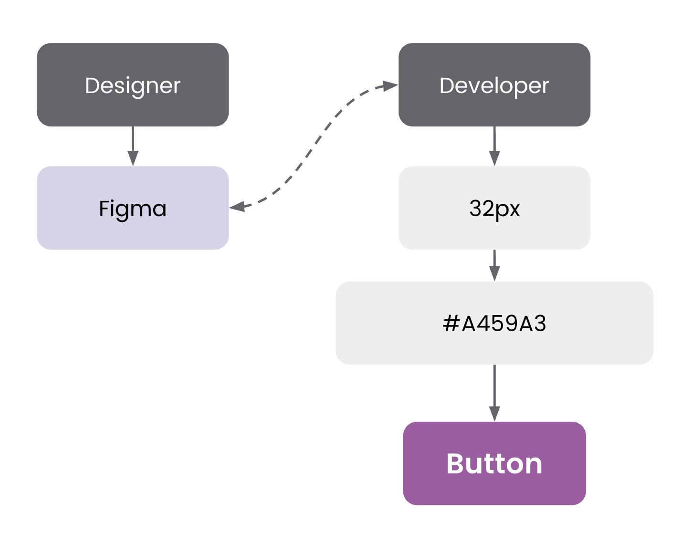
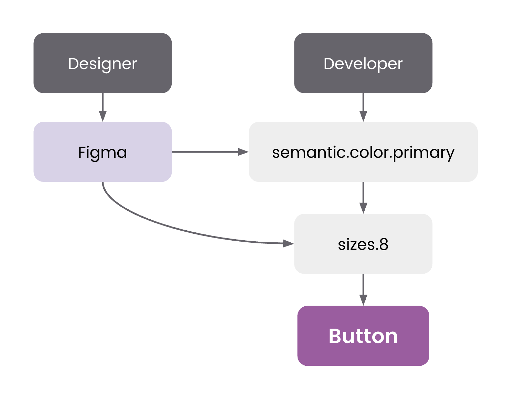

<header>

# Design Tokens: The Unseen Hero in a Changing Design Landscape

#### A Shared Language in Turbulent Times.

</header>

### The Bedrock in Shifting Sand

I remember standing in a client workshop a few months ago, surrounded by designers, developers, and product folks. We were talking about the whirlwind of change in our industry – how AI is rewriting workflows, how new tools emerge every quarter, how designers and engineers are increasingly wearing each other’s hats. In this volatile landscape, someone asked: “What’s one thing we can invest in that won’t be outdated next year?” My answer was immediate: design tokens.

Design tokens aren’t new or shiny; they’ve been around long enough to lose the hype factor. But that’s exactly why they’re worth your attention. In a time when everything else in tech feels like shifting sand, tokens are the bedrock. Think of a design token as a tiny piece of your design’s DNA – a named value for a color, a spacing unit, a typography style. These little data nuggets become a shared language that everyone on a team (and even our software tools) can speak. They’re the stable building blocks that persist even as the design tools and processes around them keep evolving. One recent industry article put it well: a solid token naming convention lets designers, developers, product managers and even automation tools “speak the same language” and stay consistent
browserlondon.com
. In other words, tokens turn design decisions into a common dialect, bridging people and platforms alike.

### When Design Lacks Tokens

What happens if you don’t have this shared language? I’ve seen firsthand how things go off the rails. Picture an enterprise product team without design tokens. Every new project or feature is a blank slate of values – colors picked from scratch, paddings eyeballed anew in each design file, developers hard-coding what they think matches the mockups. It might look fine at first, but over time the cracks show.

Inconsistent Styles: Without tokens, small divergences creep in. One app’s “primary blue” isn’t exactly the same hex value in another product. Font sizes vary by a pixel or two because different developers guessed differently. Little by little, the brand’s visual identity frays at the edges.

Manual Overrides & Fragile Styling: Designers end up nudging elements manually to fix spacing on each screen. Developers override styles case by case. These fixes are brittle – a single change in one place can accidentally break four others because nothing is centrally defined.

QA Drift: Quality assurance folks start flagging UI bugs that aren’t code issues at all – they’re consistency issues. “This padding looks off compared to design.” “That button color is slightly different on iOS versus web.” Without a single source of truth, every handoff becomes an opportunity for misalignment.

Slow, Costly Updates: Now imagine an executive says “We’re refreshing the brand’s color palette.” Without tokens, that’s a nightmare. Teams have to hunt through dozens of files and codebases, updating values one by one, unsure if they caught everything. It’s slow, error-prone, and expensive in terms of effort.

In short, not using design tokens often means design by guesswork and endless tweaking. It’s stressful for everyone: designers feel like they’re herding cats, developers feel like they’re chasing a moving target, and PMs see timelines slip due to “yet another visual fix.”

### How Design Tokens Elevate Collaboration

Now contrast that with a team that’s embraced design tokens. Here, every color, spacing, and typographic scale is anchored by a token name – a single source of truth that’s referenced everywhere. The design tool, the codebase, the style guide all pull from the same dictionary of values. This creates a different world:

Consistency by Default: With tokens, the primary-blue or spacing-md means the same thing everywhere. Change it once, and it updates across design files and front-end code. Consistency stops being a manual effort and becomes a natural byproduct of the system. Visual drift practically disappears because there’s no opportunity for random deviations – the token is the token, period.

Shared Source of Truth: Designers and developers start speaking in the same terms. A designer doesn’t hand off “40px margin” and hope it translates; they specify a spacing-large token, which the developer uses directly. It’s the same value, with a clear meaning. This cuts down confusion and back-and-forth dramatically. It’s as if the team suddenly clicks into a more harmonious gear because everyone’s referencing the exact same definitions.

Scalability and Interoperability: Need a dark mode or a holiday-themed UI? With tokens, you don’t rebuild – you just swap token collections or themes. For example, define a dark theme token set that maps to different color values, and your product can switch modes instantly. Tokens make your design system interoperable with new contexts and platforms. A robust token library lets you launch new brands or variations in a fraction of the time, since you’re configuring data, not redesigning from scratch.

Reduced Technical Debt: Because styles are centralized, technical debt from design inconsistencies goes down. Developers aren’t writing custom CSS for one-off cases – they use the token. This means fewer bugs to fix later and less maintenance burden. In fact, enterprises find that a good token system helps changes cascade safely, avoiding the “silos” and fragmentation that plague long-lived products.

Perhaps the biggest benefit I’ve observed is clarity. Tokens force you to name things and decide their purpose (“This is a secondary text color” or “this is the base spacing for forms”), which encourages thoughtful design decisions. And once those decisions are made, everyone can execute on them confidently. Instead of stifling creativity, this clarity frees the team to focus on higher-level problems because the basics are handled.

### Real Stories: From Chaos to Clarity

Some of the most convincing arguments for design tokens come from seeing them in action. Here are a few anonymized tales from recent client engagements that highlighted the pain of not having tokens – and the relief after adopting them.

Branding at Scale: One client, a global retail enterprise, struggled with scaling their brand across dozens of digital products. Every time marketing introduced a new seasonal color or updated the logo, it set off a scramble. Each product team made manual changes, and inevitably, something would be off-brand in a high-stakes release. During a workshop, their design lead admitted, “We spend more time policing colors and fonts than designing new features.” Our team helped them implement a design token system that layered global base tokens with brand-specific overrides. The difference was night and day. When the next campaign rolled out, they updated a handful of token values and every interface updated in unison. What used to take weeks of cross-team coordination became an afternoon’s work. The design lead joked that it felt like cheating – consistency was no longer a battle, but a given.

Design-Dev Alignment: Another project involved a finance software firm where designers and developers were constantly misaligned. Designers would specify styles in Figma, but when the product hit QA, there were dozens of “small visual bugs.” In truth, the developers weren’t sloppy – they just didn’t have the same references. In one retrospective meeting, a front-end dev vented: “If I had known what exact shade of blue you meant, I’d have used it!” We introduced tokens as the common language to fix this. The design team defined a clear set of tokens (colors, spacing, typography) and named them intuitively. We synced those tokens with the dev team’s code variables. Suddenly, when a designer said “use the secondary background token,” everyone knew what value that was. The next release had near-zero visual discrepancies. More importantly, trust grew between design and engineering – tokens removed the ambiguity that had been souring their collaboration.

AI-Assisted Workflows: Perhaps the most forward-looking example came from a company experimenting with AI in their development process. They were using a generative AI tool to help write UI code from natural language prompts. Early on, the AI’s output looked nothing like their established design style. The reason? The AI had no context of the company’s design system – it was pulling generic styles. We helped them feed their design token library into the AI’s knowledge base. The effect was dramatic. Once the AI “knew” the approved tokens (color values, border radii, etc.), it started generating components that fit right in with their existing screens. This exercise was a revelation for the client: if you want to future-proof your design in an AI-driven world, you need to give the machines the same source of truth you give your people. It echoes what others in the industry are seeing too – with new tech like Figma’s Model integration, an AI agent can use live token data to generate consistent components and even suggest design tweaks aligned with your system. In short, design tokens not only align humans, but set up our AI assistants for success in maintaining design consistency.

Each of these stories comes back to a simple theme: tokens turn chaos into clarity. They’re not about adding bureaucracy; they’re about removing the arbitrary variations and misunderstandings that slow teams down. And interestingly, these wins weren’t about creating perfect design systems overnight – they were about making impactful improvements with just a bit of structure.

### Adaptability Over Perfection

It’s worth addressing a common hesitation: the fear that “we’re not ready for design tokens” or “we’ll do it when we can do it perfectly.” I hear this from teams who feel they must map out every possible token and variant before starting, which can be paralyzing. Let me share a secret learned over years of systems work: design tokens don’t have to be complete or perfect to be useful. In fact, no design system is ever truly complete – and that’s okay. The goal is to start establishing a stable backbone that you can build on and adapt.

Start with the basics: your core colors, a simple spacing scale, primary and secondary fonts. These are the atomic building blocks that almost every interface uses.

Get those into a token format and let your team start referencing them. Even this small step yields immediate returns – fewer inconsistencies, easier theming, less guesswork. From there, you can gradually expand: maybe add tokens for common component sizes, for animations, for z-index layers, whatever your team finds useful. The key is iterative improvement. As one of my colleagues likes to say, “Be kind to yourself and start small”. You can always refine naming or add new tokens as your design language evolves.

Crucially, tokens themselves help you handle change. If a new device or platform comes along, you’re not going back to square one – you’re extending your existing token set to cover it. If your brand undertakes a refresh, you update values in one place instead of redesigning every screen. In this way, a token system makes your design adaptable. It provides a safety net for change, which is a huge relief in an era where change is the only constant. Rather than aiming for a mythical state of perfection, aim for resilience. A token that’s 90% right and used consistently is better than ten bespoke styles that are 100% ideal in isolation but collectively a maintenance headache.

### Looking Forward: Tokens as a Timeless Investment

It’s 2025, and I know some designers are wondering if traditional deliverables and static guidelines will even matter in a few years. With AI co-designers and code-based tooling on the rise, isn’t the future all about dynamic generation rather than static definitions? It’s a fair question – the creative process is becoming more fluid, and yes, even code editors (the “IDEs” of the world) are turning into creative spaces where design decisions happen on the fly. In this climate, it might seem counterintuitive to champion something as seemingly old-school as design tokens. But from what I’ve seen, that’s exactly why tokens are one of the few bets truly worth making. They are not about chasing hype; they’re about ensuring resilience and shared understanding amid whatever changes come next.

Design tokens ground your design practice. They allow all the new, exciting tools – whether it’s an AI design assistant, a new collaborative platform, or a cross-functional workflow – to plug into a common foundation. When everything else is in flux, tokens are the anchor that keeps your brand and user experience from drifting. And far from being a static relic of “design ops,” tokens are evolving too: they’re becoming more integrated, more real-time, more intertwined with code and AI. Their form might change (today it’s JSON in a repository, tomorrow it might be a live sync with a design AI), but the underlying concept of a shared source of truth is timeless.

So if you’re a design leader or an engineer or a product owner debating where to put your effort – consider investing in design tokens. Not because they’re glamorous (they’re not), and not because they solve everything (they won’t). Do it because in a fast-moving, unpredictable tech world, they give you something solid to count on. They let your teams adapt without losing cohesion. They make sure that as you embrace new ideas and tools, you’re not rebuilding the basics each time. In my experience, that kind of stability is rare. It’s like a common language that doesn’t age out.

In the end, design tokens are a humble kind of hero. They work in the background, quietly ensuring that your vision stays intact even as the canvas and the painters change. Enterprises that invest in that shared language and system thinking today will thank themselves tomorrow when they’re able to weather changes – be it a rebrand, a tool swap, or an AI revolution – with confidence and clarity. In a world obsessed with the next big thing, sometimes the wisest move is to double down on the fundamentals. Design tokens may not be shiny, but they are certainly enduring – and in the grand scheme of creating great products consistently, that endurance is gold.