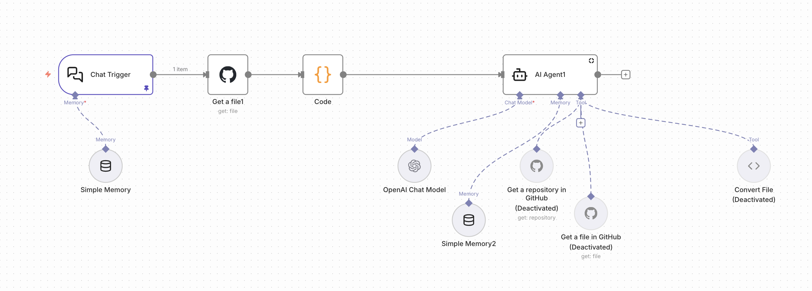

<header>

# Building My Portfolio: A Design System Playground

#### Design Systems, Vue.js, Markdown, Variable Fonts, AI Integration

</header>

*Caption: The portfolio site serves as both a showcase and a living design system, demonstrating token-based theming, markdown rendering, and component reusability.*

This portfolio site isn’t just a showcase of my work—it’s a playground for experimentation, a testbed for design system thinking, and a demonstration of how thoughtful architecture can make even complex features feel simple. Built with Vue.js, it features a fully-styled markdown renderer, token-based theming with user mode switching, variable font typography, and an AI chatbot trained on the site’s content.

## The Philosophy: Simple Surface, Complex Foundation

The goal was to create a site that feels effortless to use but reveals sophisticated engineering under the hood. Every component is designed for reusability, every token is intentional, and every feature serves both form and function. This isn’t just a portfolio—it’s a case study in building systems that scale.

## The Markdown Renderer: Write Freely, Render Beautifully

One of the features I’m most proud of is the markdown rendering system. It’s not just a basic markdown parser—it’s a fully-styled, production-ready content management system that gives me complete freedom to write and publish.

### Why This Matters

The markdown renderer means I can write content freely in any text editor, commit it to Git, and have it automatically render with a custom, beautifully-styled layout—no CMS required. I write markdown files, and the site handles everything else: hero images, typography, code highlighting, tables, blockquotes, and more.

This approach gives me:
- **Complete Control**: I own my content, stored as simple markdown files
- **Version History**: Every article change is tracked in Git
- **Custom Layouts**: Each article can have unique styling without touching a CMS
- **Fast Publishing**: Write, commit, deploy—no content management overhead

### Smart Features

The renderer automatically:
- Extracts hero images and metadata from markdown headers
- Generates a table of contents with active heading tracking
- Handles syntax highlighting for code blocks
- Groups content into animated sections
- Adapts images and layouts responsively

*Caption: Comprehensive markdown styling includes custom typography, code blocks with syntax highlighting, tables, blockquotes, and accordions—all using design tokens.*

The result is a content system that feels as polished as a custom CMS but with the simplicity and freedom of writing plain text files. I can focus on writing, not wrestling with content management interfaces.

## Token-Based Theming: Instant Mode Switching

The theming system is built entirely on CSS custom properties (design tokens), allowing for seamless theme switching without rebuilding components or touching individual styles.

### Why This Matters

With token-based theming, changing the entire site’s appearance is as simple as swapping a class name. Every component automatically adapts because they all reference the same tokens. Want a dark mode? It’s already there. Want to add a new theme? Just define a new set of tokens.

This approach means:
- **Instant Switching**: Users can toggle themes with zero delay
- **Consistent Updates**: Change a token value, and it updates everywhere
- **Future-Proof**: Adding new themes requires no component changes
- **Developer Experience**: Clear, discoverable design values

### How It Works

The system uses three layers: base tokens for the default theme, dark theme overrides, and system preference detection. When a user switches themes, the entire site updates instantly because every color, spacing, and typography value references these tokens.

*Caption: The theme system uses CSS custom properties for instant switching between light and dark modes, with all components automatically adapting.*

The beauty is in the simplicity: one token change cascades through the entire site. No hunting through component files, no duplicate style definitions—just clean, maintainable theming.

## Variable Font Typography: One Font, Infinite Possibilities

The site uses Epilogue, a variable font, with custom settings tuned for different contexts. This allows precise typography control from a single font file.

### Why This Matters

Variable fonts let me fine-tune typography for each element type—wider, bolder headings for impact; narrower, optimized body text for readability—all from one font file. This means better performance (fewer HTTP requests), precise control, and consistent typography throughout.

The typography adapts to context:
- **Headings**: Wider, bolder settings for display impact
- **Body Text**: Narrower, optimized settings for readability
- **Eyebrow Text**: Widest settings for subtle hierarchy

*Caption: Variable font settings are tuned per element type—display sizes for headings, readable sizes for body text—all from a single font file.*

This isn’t just about aesthetics—it’s about creating a typographic system that’s both expressive and performant, where every text element is optimized for its purpose.

## DynamicText: One Component, Many Uses

The `DynamicText` component is a simple but powerful abstraction I use throughout the site. It can render as any HTML element and supports both plain text and HTML content.

### Why This Matters

Instead of creating separate components for headings, paragraphs, and styled text, one flexible component handles it all. This means less code, consistent behavior, and easier maintenance.

The component is used everywhere:
- Hero banners with dynamic titles
- Text blocks with HTML descriptions
- Eyebrow text with custom styling
- Anywhere text needs to be rendered

The beauty is in its simplicity: one component, clear props, consistent behavior. It’s a small piece that makes the entire system more maintainable.

## ImageCard: Layered Layouts for Visual Interest

The `ImageCard` component uses a multi-filename system to create layered, visually interesting layouts without complex image editing.

### Why This Matters

Instead of creating composite images in design tools, I can layer multiple images in code. This means:
- **Flexibility**: Change layouts without regenerating images
- **Performance**: Individual images can be optimized separately
- **Experimentation**: Easy to try different combinations
- **Responsive**: Layers adapt to different screen sizes

The component accepts three filename props that create depth:
- Background layer for the base
- Middle layer with positioning
- Foreground layer with rotation/offset

*Caption: The ImageCard component uses layered images (filename1, filename2, filename3) to create depth and visual interest, with different variants for different contexts.*

Multiple variants (default, borderless, cover, split, list) use the same component structure but apply different CSS classes. This demonstrates the power of variant-based design: one component, many possibilities.

## The AI Chatbot: Content-Aware Assistant

One of the more experimental features is the AI chatbot trained on the site’s content. Built with n8n, it provides a conversational interface to explore the portfolio.

### Why This Matters

The chatbot demonstrates how AI can be integrated thoughtfully—not as a gimmick, but as a useful tool that understands the site’s content and can help visitors navigate and learn. It’s trained on the actual markdown content, so it knows what I’ve written about and can point people in the right direction.

*Caption: The n8n workflow connects chat triggers to content retrieval, processing, and an AI agent with memory and tool access.*

The chatbot shows:
- **Content Integration**: AI that actually knows the site’s content
- **Useful Functionality**: Helps visitors find what they’re looking for
- **Technical Experimentation**: Exploring how AI can enhance user experience

It’s a proof of concept for how AI can be integrated into content sites in a meaningful way, not just as a chat widget, but as a content-aware assistant.

## What Sets This Apart

### Freedom Over Constraints

Most portfolio sites are built on platforms that limit what you can do. This site gives me complete freedom:
- Write content in markdown, not a CMS
- Style everything exactly how I want
- Experiment with new features without platform restrictions
- Own all my content and code

### System Thinking

Every component is designed to work together:
- Tokens ensure consistency across themes
- Components compose elegantly
- Markdown provides flexible content
- Everything scales together

### Practical Experimentation

This isn’t just a showcase—it’s a working example of:
- Design system principles in practice
- Token-based architecture
- Component reusability
- Content management without a CMS

## Key Insights

### 1. Markdown-First Content

Writing in markdown means I can focus on content, not formatting. The renderer handles all the styling, so I get beautiful layouts without wrestling with a CMS interface. Content lives in Git, has version history, and is portable.

### 2. Token-Based Architecture

Using CSS custom properties for theming means the entire site can change appearance instantly. It’s not just about dark mode—it’s about creating a system where design changes are easy and consistent.

### 3. Component Reusability

Building from small, focused components means I can create new pages and features quickly. The ImageCard component, for example, works in multiple contexts with different variants, saving development time while maintaining consistency.

### 4. Variable Fonts

One font file with precise control means better performance and more expressive typography. Every text element is optimized for its purpose, creating a cohesive typographic system.

## The Result

This portfolio site demonstrates that thoughtful architecture and design system thinking can create something that’s both beautiful and maintainable. By prioritizing reusability, token-based theming, and flexible content systems, I’ve built a foundation that makes adding new features and content straightforward.

The markdown renderer means I can write freely and publish easily. The theming system means the entire site can change appearance instantly. The component architecture means new features come together quickly. And the variable fonts mean typography is both expressive and performant.

Most importantly, it was fun to build. The joy of crafting a system where everything fits together, where components compose elegantly, and where adding new content is as simple as writing markdown—that’s what makes this project special.

It’s a playground for experimentation, a showcase of capabilities, and a living example of design system principles in action.

---

*This site is continuously evolving. Check back for updates, new experiments, and refinements to the system.*
