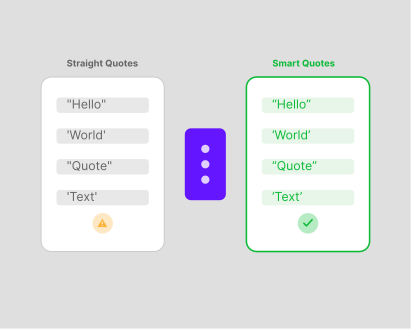

# Smart Quotes Fixer
A CLI that converts straight quotes to smart quotes in rendered content, without touching code.

| | |
|---|---|
| **Role** | Author |
| **Type** | npm Package |
| **Status** | Published |
| **Tags** | cli · npm |

## Overview

> Straight quotes inside attribute strings don't look wrong in the editor, but they break markup — and it's the kind of thing you don't notice until it's in production.

The failure mode is easy to miss: `title="I'm "Jacques""` — a sentence with inner double quotes that closes the attribute early, eating the rest of the copy or breaking the rendering entirely. It happens whenever someone pastes copy from a document into a template without thinking about the delimiter. Smart (curly) quotes prevent it, because `"` and `"` are different characters from the ASCII `"` that HTML uses to delimit attributes.

The script converts straight quotes to Unicode smart quotes in rendered text nodes only — leaving code, bindings, expressions, and attribute delimiters untouched. For Vue SFCs, it parses the template section and works only on what the user will actually read.

## Use It

```bash
# Check for straight quotes
npx @jacquesramphal/smart-quotes --check

# Auto-fix
npx @jacquesramphal/smart-quotes --write
```

Available on npm: [`@jacquesramphal/smart-quotes`](https://www.npmjs.com/package/@jacquesramphal/smart-quotes) · Source on [GitHub](https://github.com/jacquesramphal/smart-quotes)
