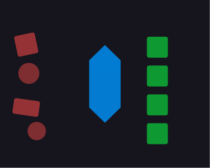

# Design Guard
A pre-commit scanner that flags hardcoded design values before they reach the codebase.

| | |
|---|---|
| **Role** | Author |
| **Type** | npm Package |
| **Status** | Published |
| **Tags** | cli · design-systems |

## Overview

> The moment you stop enforcing tokens at the point of contribution, the token system starts to decay — slowly at first, then everywhere at once.

Design Guard scans staged files before commit and flags hardcoded values that should be tokens: `px` lengths, `rem` values, hex colors, `rgb()` functions. In strict mode it fails the commit. In standard mode it warns. Either way, the drift gets surfaced at the point where it's cheapest to fix — before review, before merge, before it's in twenty components.

It runs on staged files only, keeping it fast. Configurable via `design-guard.config.json` — include/exclude paths, ignore files, tolerance thresholds. Individual lines can be marked `design-guard:ignore` for legitimate exceptions.

## Use It

```bash
# Warn mode
npx @jacquesramphal/design-guard --verbose

# Strict mode (fails commit or CI)
npx @jacquesramphal/design-guard --strict --verbose
```

Available on npm: [`@jacquesramphal/design-guard`](https://www.npmjs.com/package/@jacquesramphal/design-guard) · Source on [GitHub](https://github.com/jacquesramphal/design-guard)
