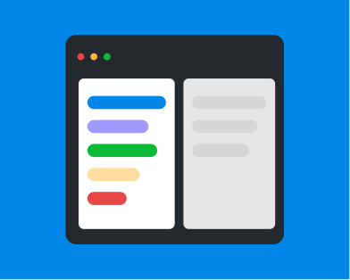

# Manual vs. Automated Is the Wrong Debate

The complementary role of human and machine intelligence

Automation speeds things up. It doesn't add judgment.

Automation can compare, detect, flag, and measure. But it cannot judge meaning.

A system can tell you that spacing changed by two pixels.
It cannot tell you whether the experience improved.

Human oversight remains essential — not because tools are weak, but because judgment is contextual.

Quality work depends on machines for detection, humans for discernment, and shared standards for coherence.
