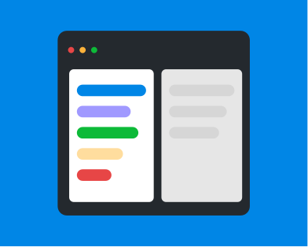

# Manual vs. Automated Is the Wrong Debate

The complementary role of human and machine intelligence

On one project we automated the entire visual-regression pass. Every build, the system diffed thousands of screens and flagged every pixel that moved. It caught things no one scanning by hand ever would, and it caught them in seconds. Then it flagged a two-pixel shift in a button's padding with the same red urgency as a checkout flow that had quietly broken. The machine could see that something had changed. It had nothing to say about whether the change mattered.

That's the line that actually divides the work, and it isn't manual versus automated. It's detection versus discernment.

The obvious objection is that the machines discern now too. Ask a model whether the experience improved and it will answer, fluently, with reasons. Increasingly, those reasons are good ones. That's real, and I use it every day. But a judgment you didn't make is a judgment you can't stand behind. The model doesn't carry the consequence of being wrong, doesn't know what this release promised the client, doesn't feel what your users will feel. It widens the set of options you can consider. It can't be the one accountable for the call.

So the split holds; it just moves. Machines detect and draft; humans decide and own the decision. Shared standards keep both honest, because without a baseline neither detection nor discernment has anything to measure against.

Automation was never intelligence. It's acceleration. The faster it gets, the more it matters that someone can say why.
