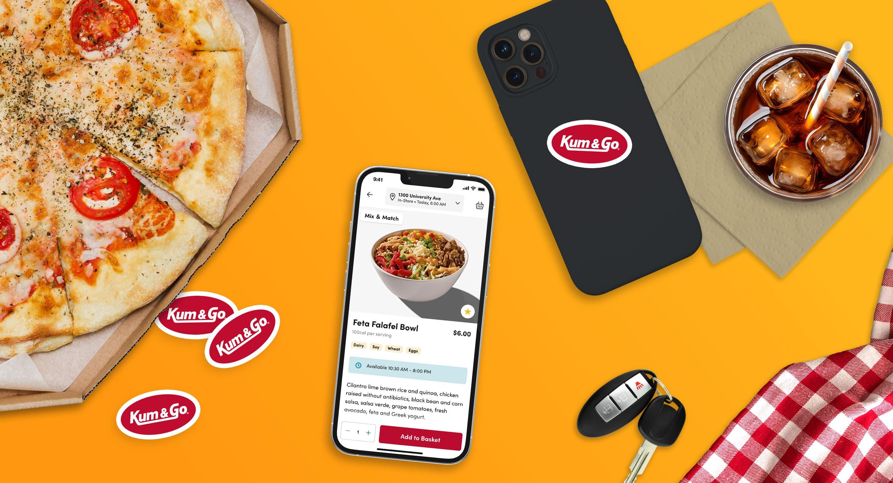
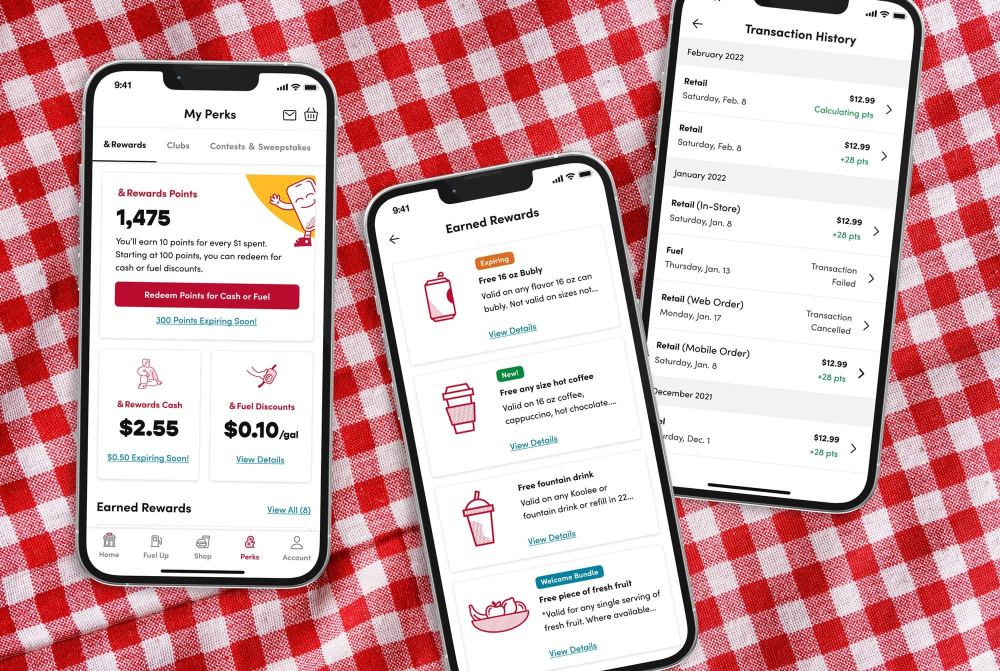

<header>
# K&G Loyalty Platform
#### Product Design, Design Systems, Development
</header>

Founded in 1959, Kum & Go redefines convenience with customer-centric offerings. Partnering with Orium, they launched a new digital experience featuring enhanced promotions, loyalty programs, and improved merchandising.

- **Role:** Lead Product Designer, Developer

- **Status:** Launched

## Key Focus Areas

- **Control Over Digital Experience:** Empowering Kum & Go to manage their search, merchandising, promotions, loyalty, and content independently.

- **Increased Customer Engagement:** Launching a robust loyalty program to engage a larger segment of the consumer base.

- **More In-Store Purchases:** Enhancing the omnichannel experience to drive more in-store purchases.

- **Extensible and Maintainable Platform:** Moving off a costly legacy platform to a more efficient and innovative system.

## Problem

Kum & Go aimed to redefine convenience for their customers by upgrading their digital experience. They sought to enhance their mobile app to include better search and merchandising, a new loyalty program, and support for modern shopping preferences. Additionally, the new app needed to be adaptable for future updates and improvements without causing any service disruptions.

*Identifying opportunities to enhance the mobile app experience.*

## Solution

To achieve these goals, Kum & Go partnered with Orium to implement a flexible and scalable platform focusing on four key objectives: control over digital experience, increased customer engagement, more in-store purchases, and an extensible platform.

Orium worked with Kum & Go to develop a React Native framework, leveraging Orium's React Native Accelerator for a faster, more efficient development process. Contentful's composable content platform was implemented for easy content management, and Typesense was used for search and product indexing. Paytronix was chosen to manage the loyalty program, providing comprehensive loyalty, promotions, and ordering capabilities. Integration with P97 enhanced Mobile Fuel Pay, allowing for prepaying gas and redeeming points at the pump.

*Modern mobile architecture with React Native and composable content management.*

## Outcome

The revamped Kum & Go mobile app launched with an upgraded rewards program and an enhanced ecommerce experience. Key features included a personalized interface, home location selection, and customer history-based recommendations. The Mobile Fuel Pay feature was also improved, allowing customers to prepay for gas in selected increments.

Kum & Go plans to continue enhancing the mobile app and redesigning the web experience to match the new mobile app features.

*Launched mobile app with enhanced loyalty program and ecommerce capabilities.*

---

## Reflection

The K&G project wasn't just about shipping an app — it was about handing Kum & Go the controls to evolve their digital experience independently. The composable architecture meant that new features, promotions, and content could be managed without an external partner involved in every update.

The real measure of success wasn't the launch itself. It was building a platform that didn't need us anymore.
