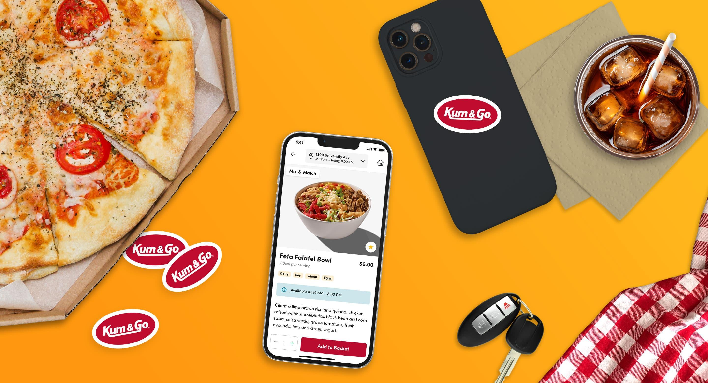
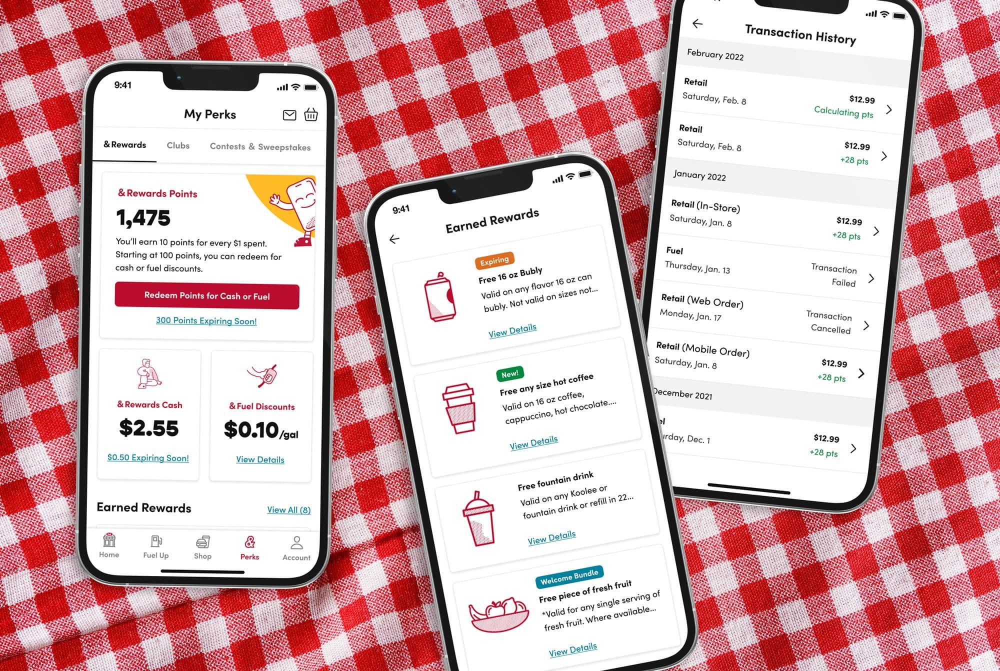

# Kum & Go Mobile Loyalty App
A composable mobile app with loyalty, fuel pay, and promotions for a convenience retailer ready to own its digital experience.

| | |
|---|---|
| **Role** | Lead Product Designer · Developer |
| **Client** | Kum & Go / Orium |
| **Status** | Launched · 2022 |
| **Tags** | product-design · mobile · loyalty |

## Overview

Kum & Go wanted to own their digital experience — not just run it.

That meant moving off a legacy platform onto something their team could manage, extend, and evolve without routing every change through an external partner. The existing app was limited with promotions, couldn't surface personalized offers, and didn't connect the in-store experience to the mobile one in any meaningful way. The goal was to rebuild it on a composable foundation and launch a loyalty program that could anchor a longer-term relationship with their customers.

## My Role

I led design across the app — loyalty program flows, merchandising, Mobile Fuel Pay, and the component system — and contributed to front-end development alongside the build team.

I owned the design from early concepts through handoff and QA, working directly in code on components and integration points. The loyalty and fuel pay flows required close collaboration with the Paytronix and P97 integration teams.

## The Constraint

The app needed to feel like a genuine loyalty platform, not a points counter bolted onto a fuel app — and it needed to launch without disrupting a service customers already relied on.

Kum & Go's customers use the app at the pump, often quickly, often in bad weather. Every additional step in a flow has a real cost. The loyalty program had to reward behavior customers were already doing without requiring them to learn a new mental model. And the architecture needed to be extensible enough that Kum & Go could add features independently after launch.

## Approach

Building the loyalty program around the physical experience first — the pump, the store, the moment of transaction.

The personalized feed surfaced offers based on purchase history. Home location selection made the app feel contextually aware. Mobile Fuel Pay, integrated with P97, let customers prepay for gas and redeem points without leaving the app — closing the loop between digital and physical that most retail loyalty programs treat as separate concerns. Contentful handled content management so Kum & Go's marketing team could update promotions independently.

*Mobile Fuel Pay and loyalty program integration — the core of the in-store digital experience.*

## Outcome

The app launched with the loyalty program, Mobile Fuel Pay, and a personalized experience Kum & Go's team could manage and extend on their own.

Rewards enrollment, personalized offers, pump-side redemption — all live at launch. Kum & Go moved off the legacy platform without service disruption and came out with a codebase they owned.

*Launched app with upgraded rewards program and enhanced ecommerce capabilities.*

## What I Learned

Designing for the pump is designing for a constrained moment — a customer outside, possibly cold, with a car that needs fuel. Every extra tap matters.

What I came away with is a stronger instinct for flow economy in transactional contexts: fewer decisions, faster paths, feedback that confirms without demanding attention. The design decisions that matter most are the ones that respect the user's time at the point of transaction.
