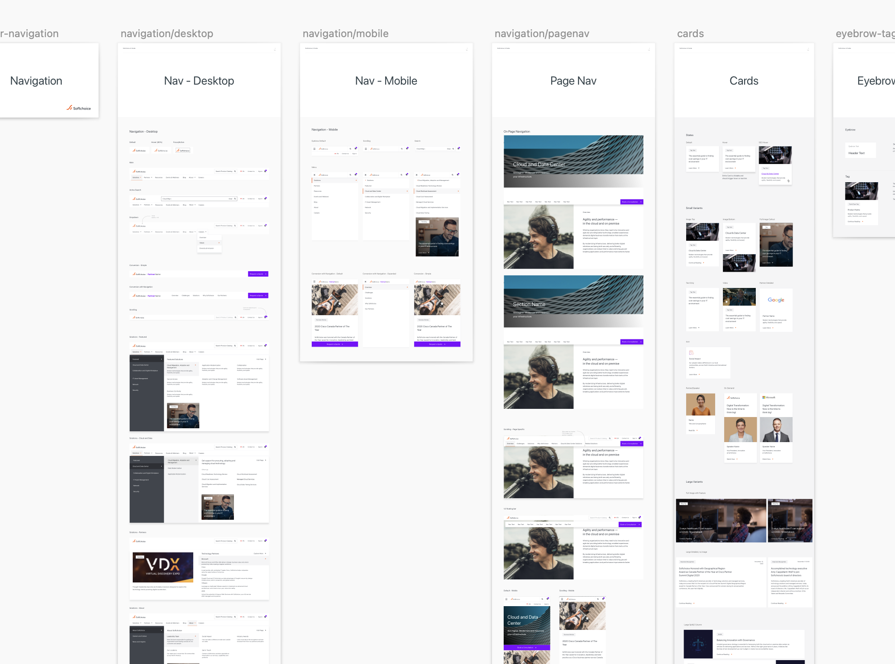
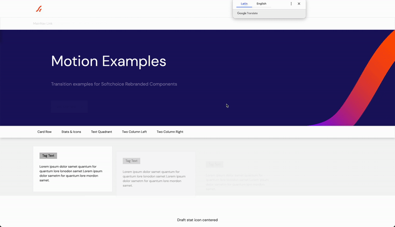

# Softchoice Website Rebrand

#### Brand Design, Motion Design, CMS Integration

 

When a brand launches a new identity, the website needs to reflect it—without breaking what already works. Redesigned Softchoice's website to reflect their new brand identity, working within their existing CMS structure. Enhanced modules, introduced motion design, and collaborated closely with development to ensure design fidelity.

- **Role:** Lead Product Designer

- **Status:** Launched

## Key Outcomes

- **Consistent Brand Identity:** The website now fully reflects Softchoice's new brand identity. Every module, every page, every interaction feels like it belongs to the same visual language. This consistency builds trust and reinforces brand recognition.

- **Enhanced User Experience:** The thoughtful module redesign and light animations created a more engaging and intuitive interface. Users don't notice the individual improvements—they just feel that the site is more polished, more professional, more aligned with what they expect from Softchoice.

- **Efficient Development Process:** Clear specifications and ongoing collaboration meant the development team could implement the design accurately without constant back-and-forth. The detailed guidelines reduced ambiguity and sped up the implementation phase.

- **Collaborative Success:** This project required coordination between multiple parties: the design partner, the branding agency that created the new identity, and Softchoice's internal IT team. The success came from everyone understanding their role and working together toward a shared vision.

## Challenge

In late 2020, Softchoice was preparing to launch a new brand identity in January. Their website, built on an interim design from August 2020, had incomplete design elements and wasn't ready to represent the new brand. The challenge wasn't just visual—it was about enhancing the experience while respecting the existing CMS architecture that was already serving the organization well.

The constraint: We couldn't rebuild the site. We had to work within the established module-driven CMS structure, enhancing and polishing without disrupting what was already functioning.

This is a common scenario in enterprise work: you're not starting from scratch. You're improving what exists while respecting the systems already in place.

*The existing website needed to reflect the new brand without breaking what already worked.*

## Approach

Rather than tearing down and rebuilding, we took a surgical approach: redesign the modules, not the system.

### Brand Guidelines as Foundation

The new brand guidelines were comprehensive—colors, typography, spacing, imagery principles. Our first step was to understand how these guidelines could translate into the existing module structure.

### Module Redesign Strategy

The CMS was built on a block model approach. Key modules included hero sections, page navigation, two-column layouts, callouts and stats, image quadrants, text quadrants, related content sections, and accordions. Each module needed to be redesigned to reflect the new brand while maintaining its functional purpose.

### Motion Design: Bringing Life to the Interface

One of the most impactful additions was introducing light animations and motion design. This wasn't about flashy effects—it was about enhancing the user experience through thoughtful motion: navigation behavior with smooth transitions, module loading that feels intentional, text appearance on scroll, and interactive navigation buttons with responsive feedback.

*Brand guidelines translated into module-driven design system.*

## Outcome

The rebrand wasn't just about new colors and fonts. It was about creating a cohesive experience that reflected Softchoice's new brand identity across every touchpoint.

Working within constraints—whether they're technical, timeline, or budget-related—forces you to be more creative, not less. We couldn't rebuild everything, so we had to be strategic about what to enhance and how to enhance it.

Sometimes the best design work happens when you're improving what exists rather than starting from scratch. It requires a different kind of creativity—one that sees potential in constraints and finds elegant solutions within established systems. This rebranding effort modernized Softchoice's online presence while respecting the foundation that was already working.

*Thoughtful motion design enhances the user experience without calling attention to itself.*

---

## Reflection

The best outcome of this project wasn't the new visual language — it was the confidence Softchoice gained to own their digital presence going forward.

Great design work often lives in the improvements no one notices: the constraint respected, the system preserved, the foundation quietly strengthened. Sometimes that's exactly the brief.
