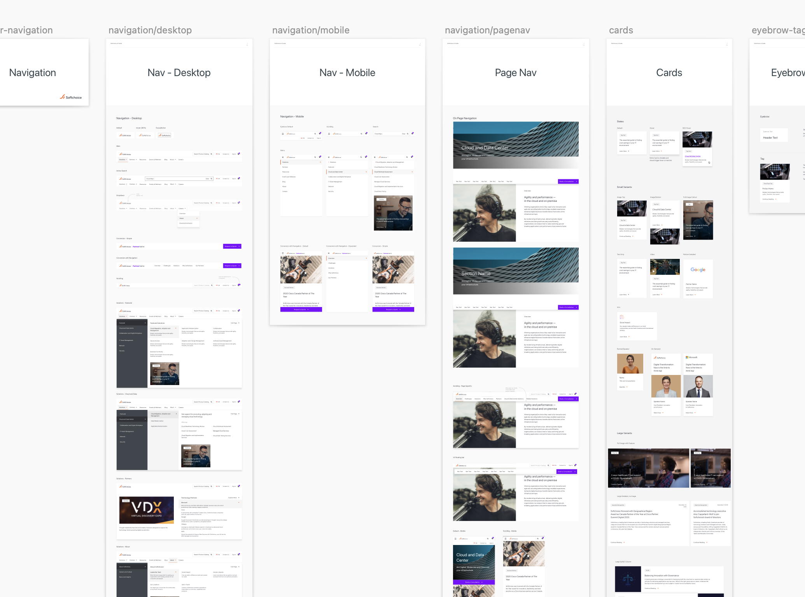
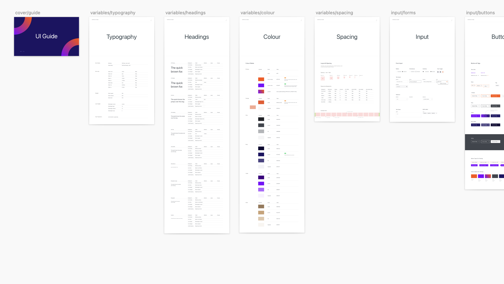

# Softchoice Website Replatform
A full brand refresh inside an existing CMS — without touching the platform.

| | |
|---|---|
| **Role** | Lead Product Designer |
| **Client** | Softchoice |
| **Status** | Launched · 2021 |
| **Tags** | brand-design · motion · cms |

## Overview

Softchoice was launching a new brand identity in January, and their website wasn't ready to represent it — the brief was to get it there without rebuilding anything.

The CMS was already serving the organization well: block-driven, extensible, familiar to the content team. The constraint was working within the existing module structure rather than replacing it — same architecture, different visual language, with motion added as a layer on top.

## My Role

I led the design across all modules — translating the new brand guidelines into the existing CMS structure — and worked directly with the development team on implementation.

The project involved coordinating between a branding agency, Softchoice's internal IT team, and the development team. I owned the module redesigns, the motion specifications, and the design-to-development handoff.

## The Constraint

The brand guidelines were comprehensive. The CMS was fixed. Every change had to fit within what the existing block structure could already do.

The modules covered the full range of the site: hero sections, navigation, two-column layouts, callouts, stats, image quadrants, accordions. Each needed to carry the new brand identity while staying functionally identical to what it replaced. Any deviation would have required development work the timeline didn't allow.

## Approach

Redesign the modules, not the system.

The brand guidelines gave clear direction on color, typography, and spacing. Translating that into modules meant working through each block type systematically — not just updating colors and fonts, but reconsidering how content was arranged within the existing constraints. Motion was added as a final layer: scroll animations that made content feel intentional, navigation transitions that gave the site continuity, interactive states that responded without calling attention to themselves.

*The module redesign process — brand guidelines mapped to existing CMS block types.*

## Design System

The module redesigns needed to hold together as a system — color, typography, spacing, and motion defined consistently enough that the content team could extend them without coming back to design for every new page.

*Component and token documentation — brand values mapped to reusable decisions so the team could maintain consistency independently.*

## Outcome

Every module now carries the new visual language, the CMS stayed exactly where the organization needed it, and Softchoice came out with a style guide for maintaining consistency without coming back to us.

The motion layer elevated the perceived quality of the experience without pulling attention from the content. The improvements no one notices are usually the ones that last.

*The launched site — new brand identity across every module, with the existing CMS structure unchanged.*

*The blog experience — new brand identity applied across content pages.*

## What I Learned

The best constraints are the ones that force precision — working inside a fixed module structure meant every decision had to earn its place.

There's a kind of design work that feels more like craft than strategy: iterating on spacing, animation timing, typographic rhythm within given boundaries. What I came away with is a clearer appreciation for how much is possible when the structure doesn't change and the only variable is the quality of execution.
