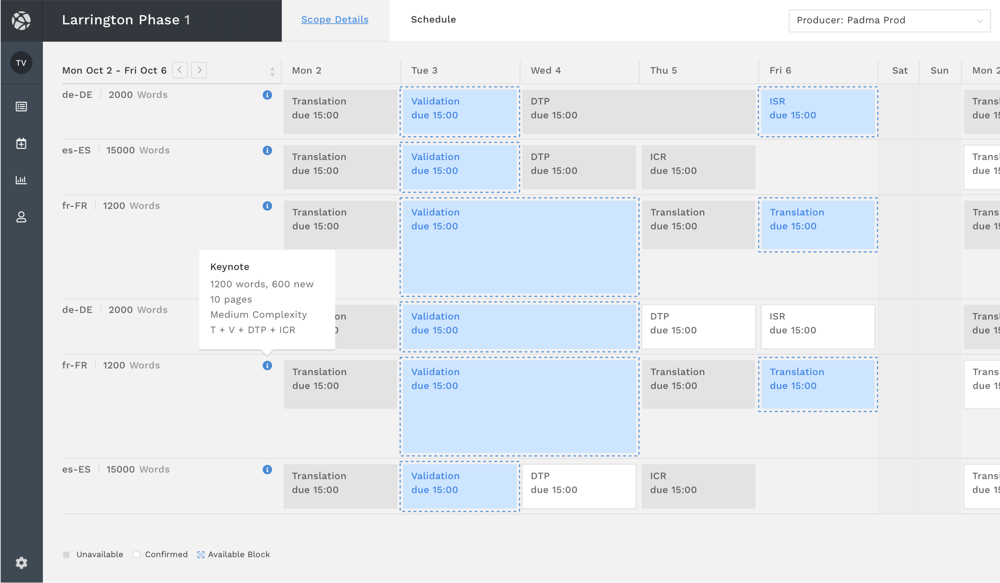
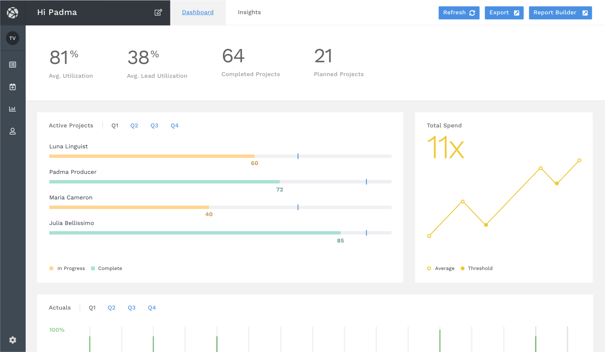
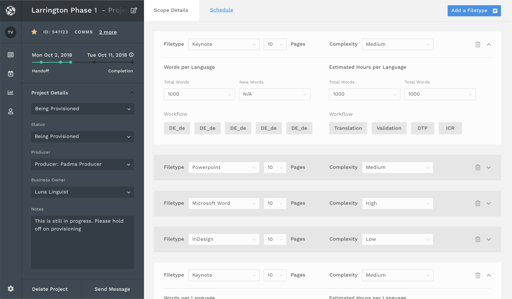

<header>

# Fortune 100 Planning Tool

#### Product Design, Dashboard Design

 

A comprehensive planning tool designed for enterprise-level strategic planning, featuring intuitive dashboards and real-time analytics for data-driven decision making.

- **Role:** Product Designer

- **Status:** Launched

## Key Focus Areas

- **Intuitive Dashboard Design:** Created an intuitive planning interface that simplifies complex enterprise data into actionable insights.

- **Real-Time Analytics:** Implemented real-time analytics capabilities to support data-driven decision making at scale.

- **Scalable Architecture:** Designed a flexible platform architecture that adapts to evolving enterprise planning needs.

- **Enhanced User Experience:** Improved workflow efficiency through thoughtful UX patterns and streamlined navigation.

## Planning Dashboard

The main planning interface provides a comprehensive view of strategic planning data with intuitive navigation and real-time updates. The dashboard enables teams to visualize key metrics, track progress, and make informed decisions quickly.

*Planning dashboard interface*

## Analytics & Insights

Advanced analytics capabilities surface key insights and trends to support data-driven decision making at the enterprise level. The insights view helps identify patterns, forecast outcomes, and optimize planning strategies.

*Analytics and insights view*

## Detailed Planning View

The detailed view allows for granular planning and analysis, enabling teams to drill down into specific metrics and projections. This level of detail supports comprehensive strategic planning and resource allocation.

*Detailed planning view*

---

## Reflection

Enterprise planning tools succeed when they disappear into the workflow. The goal was never to impress with complexity — it was to make strategic planning feel inevitable, so teams could focus on decisions rather than navigation.

When the interface stops being something people think about, the design has done its job.
