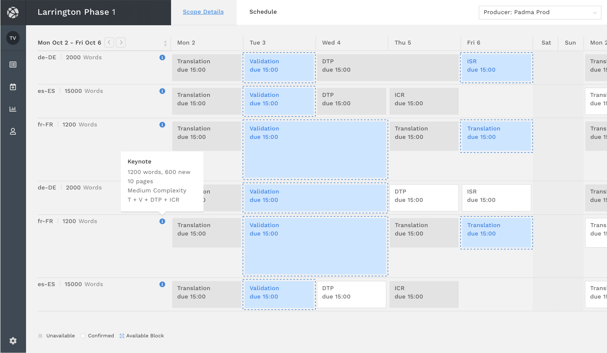
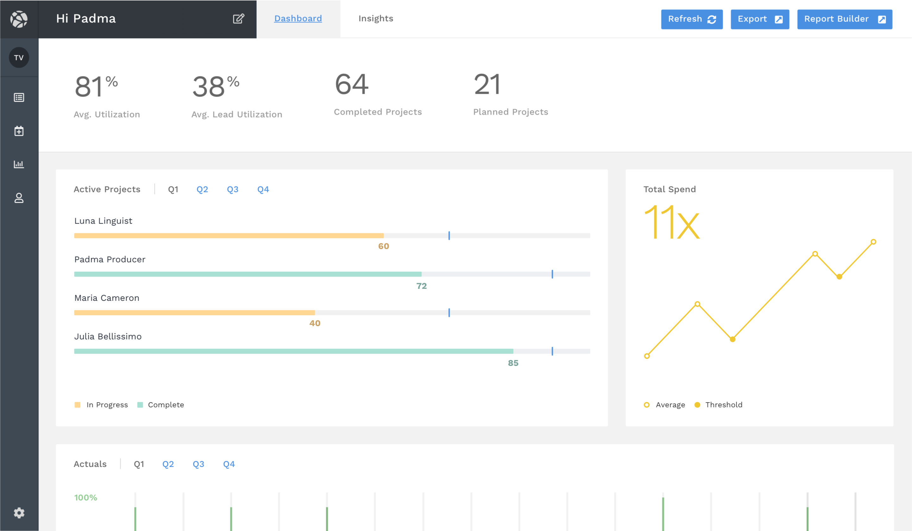
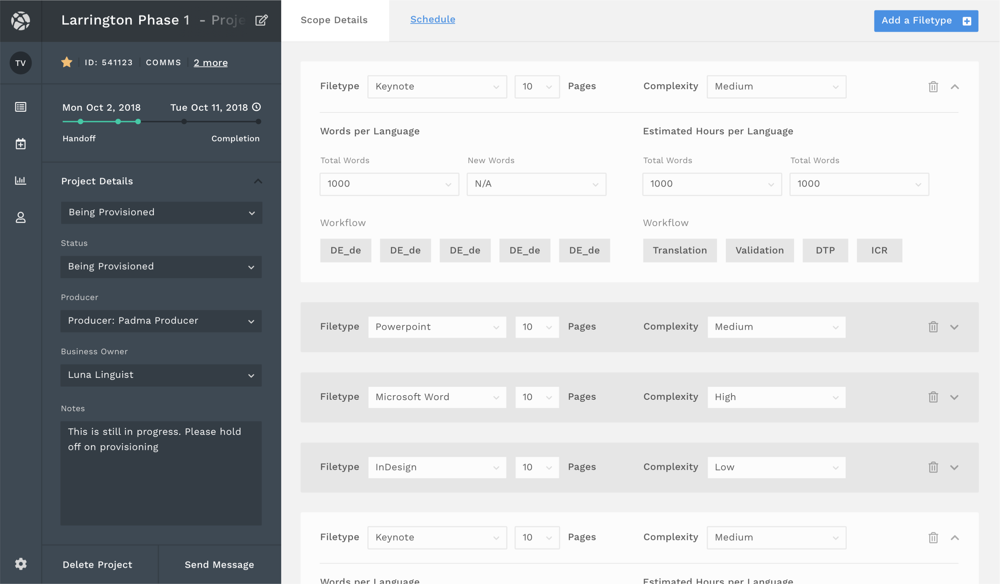

# Fortune 100 Planning Tool
A strategic planning interface for an organization managing data across business units, budgets, and initiatives at scale.

| | |
|---|---|
| **Role** | Product Designer |
| **Client** | Fortune 100 (NDA) |
| **Status** | Launched |
| **Tags** | product-design · dashboard |

## Overview

The data existed. What the organization didn't have was a way to look across it without collapsing the complexity that makes it useful.

Enterprise planning tools tend toward one of two failure modes: show everything (overwhelming) or summarize everything (useless). The challenge was finding the layer in between — a view that gave decision-makers enough overview to act, while preserving the detail that mattered. The users were executives and planners making resource decisions on tight timelines, not analysts who lived in the tool.

## My Role

I led product design from early discovery through to a launched interface, working closely with the development team and directly with users at the client organization.

I owned the UX, ran working sessions to understand how planning actually happened as opposed to how the org chart suggested it should, and designed the dashboard, the detail views, and the navigation model connecting them.

## The Constraint

The organizational data was genuinely complex — multiple layers, multiple owners, multiple formats — and flattening it to make it displayable would have destroyed its value.

Finance owned budget, operations owned initiatives, leadership owned the cross-unit view. None of those pieces had ever lived in the same interface before. Getting them into a single tool required careful decisions about what surfaced by default, what required a tap to reveal, and what could safely live a level down.

## Approach

Navigation was the primary design problem — not visualization, not aesthetics, but how a user moves from overview to specific line item and back without losing their place.

The hierarchy went: portfolio → business unit → initiative → detail. Each layer had a distinct visual treatment that made it immediately recognizable. Transitions between layers needed to feel continuous rather than disjointed. Data visualization was kept conservative: charts only where a chart communicated something a table couldn't.

*Analytics and insights view — patterns and trends surfaced across the planning dataset.*

## Outcome

The tool launched and became the primary planning interface for the organization, replacing a process that had run across disconnected spreadsheets and email threads.

Strategic planning moved from a fragmented, document-driven process into a shared interface with a common vocabulary. The client came back with iteration requests rather than structural concerns — which, for a first version, is the outcome you want.

*The detail view — granular planning at the initiative level, preserving the context of the layer above.*

## What I Learned

Enterprise tools succeed when they disappear — the goal was never to impress with complexity, it was to make strategic planning feel obvious.

When an interface stops being something people think about and becomes something they just use, the design has done its job. That's a harder standard than visual quality or feature completeness, and it takes longer to know whether you've met it.
