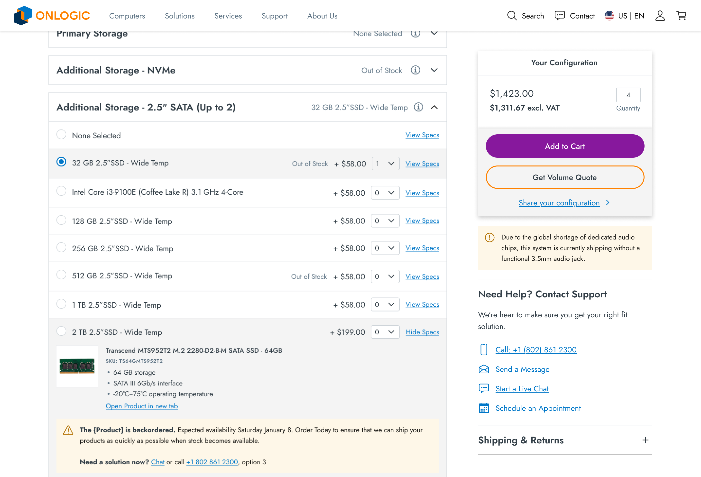
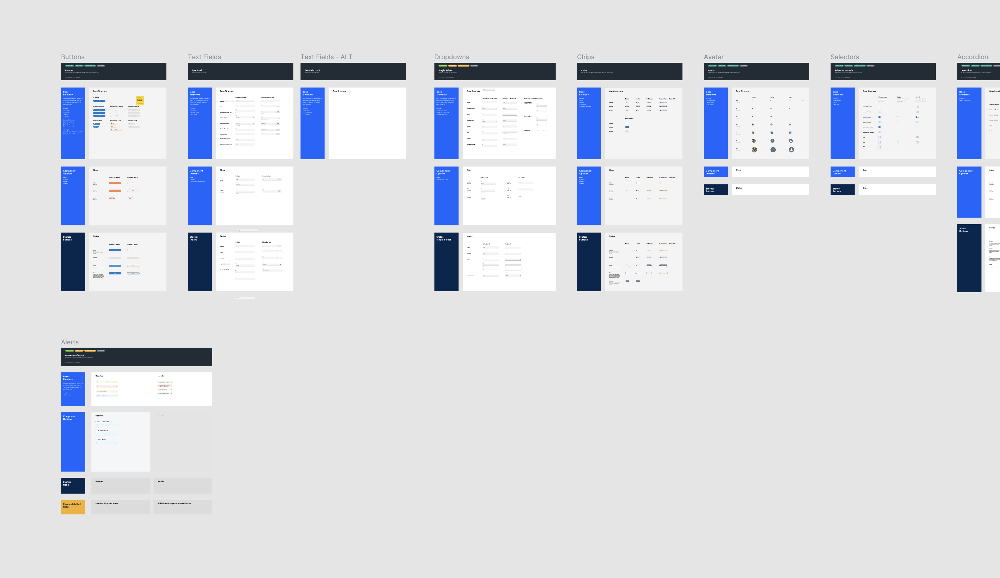
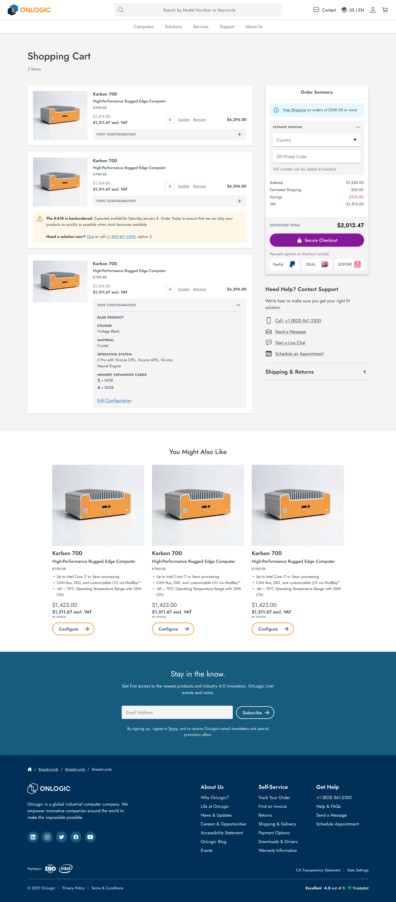
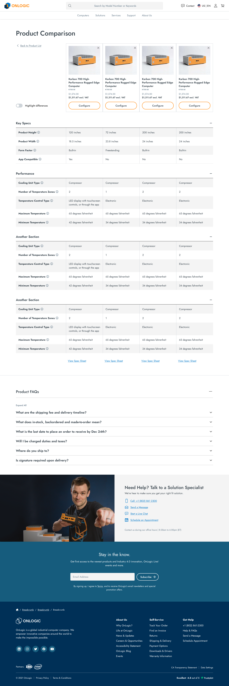

# OnLogic Product Configurator
A hardware configuration experience for IT professionals where a wrong choice has real consequences.

| | |
|---|---|
| **Role** | Product Designer |
| **Client** | OnLogic / Orium |
| **Status** | Launched |
| **Tags** | commerce · configurator · b2b |

## Key Learning

Designing for technical users means earning trust through precision. Every edge case you account for signals that the product understands its audience.

## Overview

OnLogic's customers are IT professionals configuring industrial PCs for specific deployment environments. A wrong component choice doesn't trigger a return; it triggers a failed deployment.

The legacy platform had been built for a general commerce audience and couldn't represent the dependencies between hardware components: how a processor choice limits memory options, how a chassis selection constrains thermal design. The migration to composable commerce was the opportunity to build a configuration experience that matched the precision of the audience it served.

## The Constraint

The product catalog was genuinely complex: components with real dependencies, configurations that could only be validated against hardware constraints, and users who would immediately notice any gap between what the interface implied and what was technically possible.

A standard PDP doesn't communicate component compatibility. A customer who selects an incompatible combination needs to understand why at the point of selection, not at checkout. Every dependency had to be surfaced early enough to be useful.

## Approach

### Mapping the dependency graph

Working with OnLogic's engineering team, I mapped the dependency structure for the key product categories: what depends on what, where the configuration forks, what a user needs at each step. A processor choice limits memory options. A chassis selection constrains thermal design. Those dependencies needed to be visible in the interface before a customer made an incompatible selection, not surfaced at checkout.

### The cascade configurator

The PDP became a staged experience where each selection narrows the valid options downstream. Components with incompatible configurations are filtered or flagged at the moment of selection, with inline explanation of why. Real-time price calculations updated as each selection was made, so the running total reflected the actual configuration at every step.

### A platform built to extend

The composable stack (commercetools, Contentful, Algolia) was designed with extensibility in mind. Each layer could evolve independently. The design specs were built so OnLogic's development team could add new product categories without restructuring the interface.

*The configurator: storage options cascade with per-option pricing deltas, out-of-stock states, and spec detail inline. The sticky sidebar updates the total in real time.*

*Design system components, tokens, and interaction states defined once and shared across the configurator, PDP, and checkout, built for a development team that would extend it beyond the initial scope.*

## Outcome

The platform launched with a configuration experience that matched the precision of the audience. Technical users could now configure and purchase complex hardware without consulting an external spec sheet.

Real-time validation, compatibility-driven option filtering, global payment and tax integration. The design specs were built with extensibility in mind so the development team could add new product categories without restructuring the interface.

*The cart: configured items with expandable hardware specs, volume quote option, and order summary. The configuration follows the user through to purchase.*

*Product comparison: key specs across models in a single view, so customers can validate the right configuration before committing.*

## What I Learned

Designing for technical users means earning trust through precision. Every edge case you account for signals that the product understands its audience.

The users who configure industrial hardware for a living will find every gap in your logic. That's not a problem. They're exactly the people who tell you where the experience breaks down before it ships. Map the real dependency graph before designing the interface, and make sure the UX exposes the same constraints the underlying system enforces.
