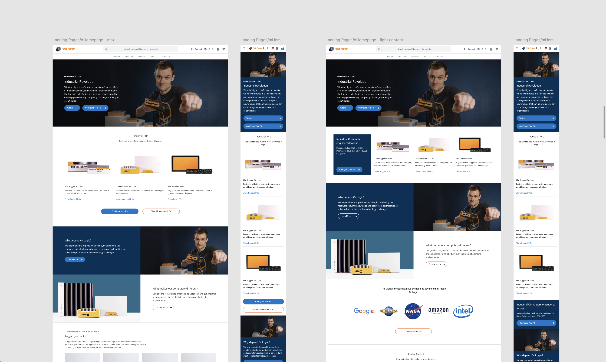

<header>

# OnLogic Composable Commerce Platform

#### E-commerce, Developer Friendly

</header>

Empowering technical users with precision, flexibility, and control for configuring industrial PC systems.

- **Role:** Product Design

- **Status:** Launched

## Key Focus Areas

- **Empower Technical Users:** Designed an interface for IT professionals and developers, providing advanced customization options with usability in mind.

- **Facilitate Developer Implementation:** Created UI workflows developers could implement and extend, aligning with composable architecture principles.

- **Support High Customizability:** Enabled configuration and purchase of highly customizable products with seamless integration of pricing, tax rules, and global payment systems.

- **Provide Transparency and Control:** Delivered detailed product configuration workflows with real-time feedback and clear user-facing data.

## Problem

OnLogic needed a platform tailored to technical users, including IT professionals, to handle the complexities of configuring customizable products. The existing legacy platform couldn't provide the precision, transparency, or scalability required to meet the needs of a global audience.

*Legacy platform lacked configurability and scalability.*

## Solution

Migrated to a composable commerce architecture using commercetools, enabling OnLogic to scale and meet modern demands. Developed configurable PDPs with real-time price calculations, validation checks, and modular designs. Integrated content management (Contentful), search (Algolia), and custom payment/tax systems to meet global requirements.

*Composable architecture tailored for technical users.*

## Outcome

The platform empowered OnLogic's technical users with advanced customization options, seamless workflows, and real-time validation. Developers benefited from detailed design handoffs and modular implementation strategies. The scalable platform allows OnLogic to evolve its offerings to meet future needs.

*Enhanced configurability and future-proof design.*

---

## Reflection

Designing for technical users means earning trust through precision. Every real-time validation, every configuration state, every edge case accounted for was a signal that the platform understood its audience.

The result was a commerce experience that felt less like a storefront and more like a professional tool — which, for OnLogic's customers, was exactly the point.
