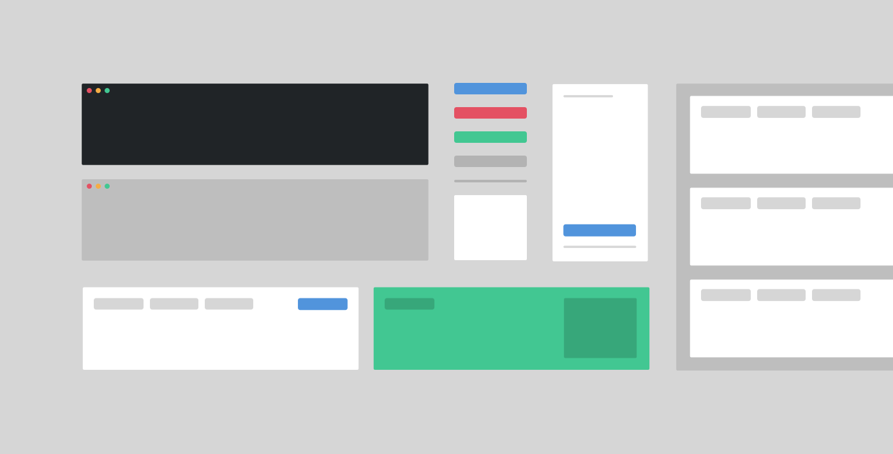

# The Ramstack: Design Tools, Complexity, and the Case for Interoperability

#### A future-proof approach to front-end design isn't about the tools—it's about the principles beneath them

We are perpetually knee-deep in the sea of design tools. The current industry standard file format is just a pitstop on a longer journey—a tool that will be succeeded by something else. It always has been. It always will be.

The question isn't which tools to use. The question is: when the tools change, will your work survive?

---

## The Headless Trap

With the domination of headless architectures, there seems to be a specialized tool for everything. One tool for X, another for Y. Endless integrations and microservices playing together to form the sprawling complexity of a modern application.

This is genuinely good in many ways—flexibility, scalability, independent deployability. But it introduces a slippery slope: more tools means more dependencies, more surfaces for failure, more onboarding for every new team member. Our products can become infinitely more complex. Headless can get messy.

The same pattern plays out in design. We adopt tools to solve specific problems, then find ourselves managing a toolbox that's harder to maintain than the work it was meant to support.

---

## The Interoperability Problem

We often dream of one tool to rule them all—a platform that respects both the designer's and developer's wishes, handles complex prototyping, exports to code, gathers feedback, and serves as a handoff layer. In practice, that tool hasn't arrived, and the pursuit of it often produces its own form of lock-in.

Tools become outdated. The next industry standard takes over. Workflows get replaced by more efficient ones. AI changes the paradigm entirely. These aren't predictions—they're descriptions of what has already happened, repeatedly.

The trick isn't finding the perfect tool. The trick is making sure the core of your practice is interoperable—agnostic of toolchain.

Design tools like Figma are powerful precisely because they're rooted in web standards: auto layout that mirrors CSS flexbox, component structures that mirror atomic design, naming conventions that align with code. But those features also create compatibility challenges. The very specificity that makes a tool productive today makes it harder to migrate from tomorrow.

---

## The Ramstack Philosophy

The Jamstack—JavaScript, APIs, and Markdown—is a headless philosophy for web architecture. Its emphasis on flexibility, scalability, and maintainability removes the need for any single platform to dictate the experience. The Ramstack extends that thinking into a personal design practice.

The goal is not a list of approved tools. It's a set of durable principles:

**Use editors that support your workflow, not editors that own it.**
The specific application matters less than what it enables. When the tool becomes unavailable or obsolete, your files should remain usable in something else. Formats that only one application can read are liabilities disguised as features.

**Choose platforms that respect open standards.**
Your content, your design decisions, your component architecture—these should be portable. Proprietary formats create technical debt the moment you commit to them. Open formats create optionality.

**Reduce dependencies to what you actually need.**
Every dependency is a liability. Every integration is a failure surface. The core of your application or design system should be self-sufficient, not a house of cards that collapses when one service changes its pricing model.

**Make your design system the source of truth, not the tool.**
If your design tokens, component decisions, and visual language live only inside a design file, you don't have a design system. You have a file that describes a design system. When that file format becomes unsupported, your system evaporates. Token-first thinking—where decisions live in version-controlled code—is more resilient than any single design tool.

---

## What This Looks Like in Practice

Write documentation in formats that don't require a subscription to read. Define design decisions as tokens that live in a repository alongside the code they govern. Choose tools that export formats others can open without the same license.

Design directly in the browser where possible—not because it's easy, but because the output is the artifact. There's no translation layer between the design and the thing the user experiences.

When evaluating tools, ask: *What happens to my work if this tool disappears tomorrow?* Not as a paranoid exercise, but as a design constraint. The answer reveals your actual dependencies.

---

The future belongs to approaches and standards, not applications and platforms. Tools come and go. Principles remain. The Ramstack isn't a prescribed set of software—it's a commitment to working in ways that outlast the tools you're using today.
