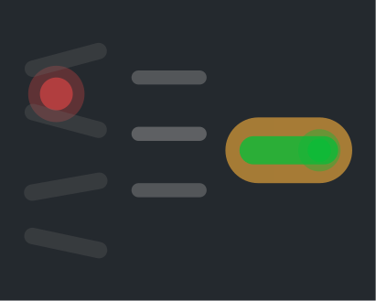

# I almost lost my job. Instead, I found my lane.

#### Designing Your Own Relevance

Like so many others, I almost lost my job during COVID.

I was part-time. Budgets were tight. The industry was uncertain. My role felt narrow. I could see how easily I might become redundant.

At the time, it felt destabilizing. In hindsight, it was a gift.

Losing certainty gave me something more valuable: space.

And space let me return to something I'd always been curious about.

## The Pattern Was Always There

I went to school for graphic design and print. During my thesis, I taught myself how to code so I could build my own website from scratch. No templates. Just HTML, CSS, and trial and error.

When I joined Myplanet (now Orium), I transitioned into UX Design. I never felt like a pure researcher. I was more interested in how things actually worked than in writing about how they might.

Looking back, there's a clear pattern.

I've always cared about the presentation layer.
How something looks.
How it behaves.
How it feels in the browser.

Print moved to web.
Web moved to interaction.
Interaction moved to systems.

The surface area changed. The instinct didn't.

## Pressure Reveals Your Niche

When COVID hit and I went part-time, I had time I didn't expect to have.

Instead of protecting my title, I followed my curiosity.

I started contributing more directly to the front end. I worked in the browser. I opened pull requests. I did design QA in GitHub. I tightened the feedback loop between design and development.

What emerged internally was a pilot role: Interface Developer.

It wasn't a reinvention. It was a formalization of something I was already leaning toward.

I wasn't trying to replace developers. I was trying to reduce friction.
To own the presentation layer more fully.
To lessen the burden on devs by catching issues earlier.
To design where the product actually lived.

That became my niche.

Not because someone handed it to me.
Because pressure revealed it.

## The Hard Lesson: Agility Requires Clarity

High contribution comes with operational challenges.

If you cross-skill without setting expectations, confusion follows.

Are you design or dev?
How do we scope your time?
What does the client think you're doing?
How is this tracked?

I learned that adaptability without communication creates friction.

So I got clearer.

I defined what I contribute.
I aligned early with PMs and devs.
I tracked my time intentionally.
I set expectations with clients.

Transferable skills create opportunity.
Clear communication sustains it.

## Transferable Skills Are the Real Safety Net

Over time, I've moved through titles:

Graphic Designer.
Interaction Designer.
UX Designer.
Product Designer.
Interface Developer.

The industry evolved. The tools evolved. The expectations evolved.

What didn't evolve were the core skills:

* Systems thinking.
* Taste and craft.
* Comfort in ambiguity.
* Ability to translate complexity into usable form.
* Willingness to learn in public.

Those skills gave me space to experiment.

They allowed me to play without panic.
To explore without abandoning my foundation.
To move into new areas without losing myself.

I didn't predict where the industry was going.
I followed what genuinely interested me.

And that curiosity kept intersecting with what the industry needed next.

## Going With Ease, Going With Discomfort

There's a temptation when things change to do one of two things:

1. Get swept away by every new trend.
2. Stand rigid on the shore defending your current identity.

Neither creates long-term relevance.

What's worked for me is something in the middle.

Observe the current.
Notice what resonates.
Move when it feels aligned.

Not with panic.
Not with ego.
With ease.

Ease doesn't mean comfort. Some of my biggest growth moments were deeply uncomfortable. Learning new technical skills. Contributing in unfamiliar repos. Building tools without formal authority. Being seen differently by leadership.

Discomfort is often a signal that you're expanding.

But expansion works best when it's grounded in something true about you.

For me, that truth was always there: I like building things where they live.

## Mindful Blockers

The biggest threats to growth aren't external. They're internal.

* Protecting an outdated identity.
* Over-rehearsing how others perceive you.
* Waiting for permission.
* Letting tools define your worth.
* Believing your niche is your job title.

When I stopped worrying about whether I was "supposed" to code and just started solving problems, influence followed naturally.

When I stopped trying to fit cleanly into one category and instead focused on delivering value, doors opened.

Influence didn't come from chasing it.
It came from contributing meaningfully in places that mattered.

## Finding Yourself in Places of Influence

I didn't set out to become a hybrid.
I didn't set out to shape internal workflows.
I didn't set out to sit at tables discussing the future of design.

I followed transferable skills.

I followed curiosity.

I stayed open when it would have been easier to retreat.

Over time, that combination created space. Space to experiment. Space to build. Space to influence.

Relevance isn't about constant reinvention.
It's about deepening your core strengths until they scale with the world around you.

## I almost lost my job. Instead, I found my lane.

And that lane keeps expanding—not because I chase what's next, but because I stay grounded in what's true about how I like to work.

Go with ease.
Go with discomfort.
Remove the blockers.

Your transferable skills will take you further than any title ever will.
