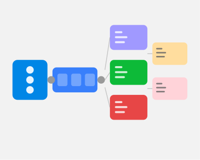

# Token Pipeline for a Multi-Brand HMI Platform
A unified design token architecture across four brands, two themes, and two modalities — with AI guardrails built in.

| | |
|---|---|
| **Role** | Sole Designer & Developer |
| **Client** | Automotive (NDA) |
| **Status** | Delivered · 2024 |
| **Tags** | design-systems · tokens · ai |

## Overview

The visual design existed in Figma and the code existed in React, and the two were drifting further apart every sprint — accelerated by AI tools generating whatever values they felt like.

The client had a multi-display vehicle HMI prototype that needed to scale across four brands, two themes, two modalities, and three screens. Colors lived simultaneously in Figma, in CSS files, and in hardcoded component values, with no enforced shared vocabulary. When a designer updated a surface color in Figma, nothing downstream knew about it.

## My Role

I was the sole designer and developer on the system layer — token architecture, pipeline, enforcement tooling, and AI guardrails, all of it.

Every decision ran through me: inheritance models, semantic naming, build tooling, ESLint rules, AI development guidelines, and the actual code to back all of it up.

## The Constraint

Four brands sharing 85% of the same values, AI tools actively widening the design–code gap, and no enforcement at any of the points where drift happens.

Brand duplication was the most mechanical problem: four JSON files each containing ~1,300 lines, most of it identical. Changing a shared spacing value meant editing five files and hoping nothing was missed. The harder problem was AI-generated code — Cursor and Claude are fast, and they're happy to write `color: #ffffff` or `padding: 16px` the moment you give them a component task.

## Approach

Treat tokens as a contract — the single source of truth between Figma, code, and AI tooling — and enforce that contract at every point where drift can happen.

### Token Architecture

The inheritance model: brand files contain only overrides against a shared base, shrinking from ~1,300 lines per brand to ~200.

```
Design Tokens/
├── Base/           ← single source of truth
├── Brand/          ← per-brand color overrides only
├── Theme/          ← Day.json, Night.json (semantic surfaces)
├── Motion/         ← duration, easing, transition presets
├── Interactions/   ← hover, active, disabled, focus
├── Platform/       ← Tap.json (HMI density), Click.json (desktop)
└── Compositions.json
```

The build output from a single generate command:

```
src/styles/tokens/
├── index.css               ← single import
├── Standard/
│   ├── brand.css
│   ├── theme-day.css
│   └── theme-night.css
└── shared/
    ├── motion.css
    └── interactions.css
```

One import. All themes, brands, and platforms — runtime-switched via data attributes, no rebuild required:

```js
document.documentElement.dataset.brand = 'Standard';
document.documentElement.dataset.theme = 'night';
document.documentElement.dataset.platform = 'tap';
```

The semantic color layer formalizes three tiers — raw primitives never touch components directly:

| Layer | Purpose | Direct use in components |
|---|---|---|
| `color-primitives` | Raw values — never used directly | ✗ |
| `color` | Brand accents | ✓ |
| `surface` / `onsurface` | Semantic theme surfaces | ✓ |

This is what makes day/night switching automatic. `--color-surface-secondary-enabled` changes meaning across themes; `#1c1c1c` never does.

### Guardrails for AI Development

This was the piece most teams skip. A perfect token system still fails if Cursor writes `padding: 16px` on every component. Three layers of enforcement:

**Layer 1 — Design Guard**

`designGuard.js` scans `src/` for hardcoded design values on every save. Heuristics rather than a full parser — fast, zero heavy dependencies.

```js
const PATTERNS = {
  hexColor:            /#[0-9a-fA-F]{3,8}\b/g,
  colorFn:             /\b(?:rgb|rgba|hsl|hsla)\s*\(/g,
  px:                  /(-?\d*\.?\d+)px\b/g,
  varFallback:         /\bvar\(\s*--[^,)\s]+\s*,/g,
  hardcodedTransition: /\btransition\s*:\s*[^;]*\b(\d*\.?\d+)(ms|s)\b/gi,
};
```

Output is grouped by file with line/column and the offending value. Strict mode runs in CI — violations block merge.

```bash
npm run lint:design         # warn, keep going
npm run lint:design:strict  # fail CI on any finding
```

**Layer 2 — Custom ESLint Rule**

The design guard covers CSS. This covers inline styles in JSX, a common AI output pattern:

```jsx
// Blocked
<div style={{ padding: '16px', color: '#fff' }} />

// Allowed
<div style={{ padding: 'var(--spacing-16)', color: 'var(--color-onsurface-primary)' }} />
```

**Layer 3 — AI Rules**

`.cursorrules` and `docs/ai/AI_DEVELOPMENT_RULES.md` give Cursor and Claude explicit stop conditions:

- Never use hex, px, or raw time values
- Never add `var()` fallbacks
- If a token doesn't exist for your use case, **stop** and use `TOKEN_REQUEST_TEMPLATE.md`
- If a component doesn't exist, **stop** and use `COMPONENT_REQUEST_TEMPLATE.md`

### Dev Pipeline

Token changes flow to the running app without extra steps:

```bash
./scripts/dev-all.sh
```

Under the hood, the frontend `package.json` watches the token JSON directory and regenerates CSS on every save:

```json
"dev": "concurrently -k -n tokens,vite \"npm:tokens:watch\" \"npm:dev:vite\"",
"tokens:watch": "nodemon --watch ../Design\\ Tokens -e json --exec npm run tokens:generate"
```

Edit token JSON → save → CSS regenerates → live reload. The full lint pipeline:

```bash
npm run lint          # design guard + stylelint + eslint (warn)
npm run lint:strict   # same, fails on any finding
```


## Outcome

One import. All themes and brands runtime-switchable. AI tools generating token-compliant code by default.

Brand duplication is gone. A broken token reference fails the build immediately. The design guard runs on every save and blocks merges in CI. Figma variables mirror the token repo via a single sync command. A quote from the client team: *"We need someone who works the way you do — someone who loves designing enterprise interfaces in Cursor or Claude."*

## What I Learned

AI tools are fast and sloppy by default — the enforcement layer isn't a workaround, it's what makes AI-assisted development compatible with a real design system.

Don't trust that AI tools will learn your conventions. Give them explicit rules, explicit stop conditions, and a linter that makes non-compliant code visible and blockable. When the guardrails are in place, Cursor and Claude generate token-compliant code not because the model understands design systems, but because the system makes anything else immediately obvious.

---

*Client and product names withheld for portfolio use.*
