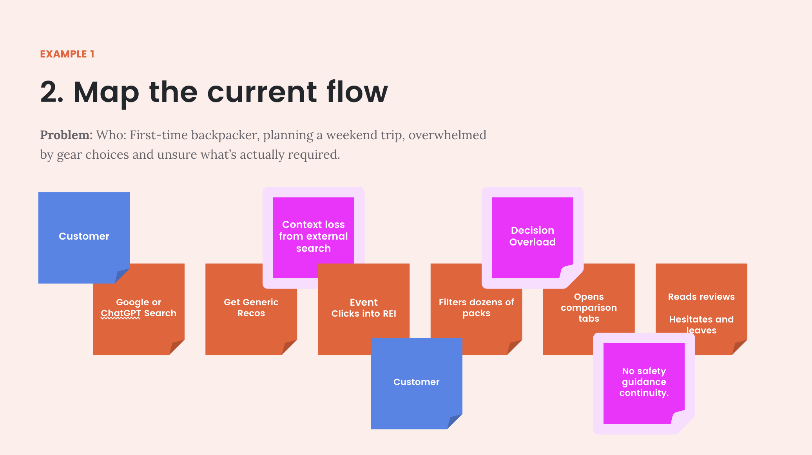
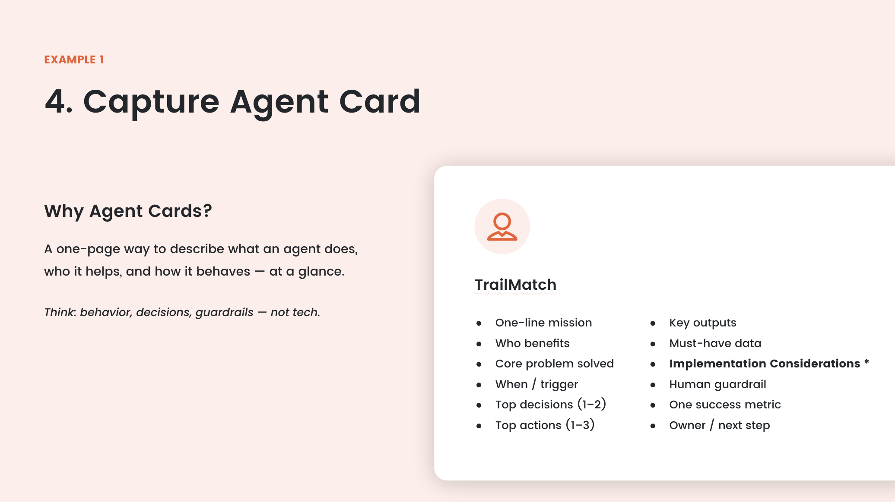

# When UX Becomes AX: How Designers Adapt in the Age of Agentic Systems

If you think AI makes design less relevant, I get it — but you’re probably looking at the wrong layer.

I keep hearing this from people I interact with: “Now it’s about agents, orchestration, automation… this isn’t really design anymore. What’s the point?” On the surface, it makes sense. When systems can decide and act on their own, it feels like design moves out of the picture. But I actually think that’s where design becomes more critical, not less.

## UX Doesn’t Disappear. It Evolves.

In a recent Agentic Experience Studio, we didn’t just design screens. We designed what an agent is allowed to decide, when it should act, when it shouldn’t, how it signals confidence, where humans approve or override, and what success and failure actually look like. That’s not traditional UI or UX design. It’s decision design. It’s decision architecture. The shift isn’t from UX to no UX — it’s from interface design to behavior design.

## From Screens to Systems

UX has always been about systems; we just focused mostly on the visible layer. Now the invisible layer matters just as much: how work flows across tools, where decisions bottleneck, where coordination breaks down, and where trust erodes. Designing agents means designing behavior inside those systems.

When systems can act autonomously, the cost of bad decision design is higher than the cost of bad visual design. Guardrails, oversight, and clarity of ownership aren’t secondary considerations — they’re core design concerns. This isn’t design disappearing. It’s design expanding.

## The Skills Already Transfer

What excites me most is how directly our existing skills apply. Designers are trained to frame ambiguous problems, make invisible systems visible, facilitate cross-functional alignment, surface tradeoffs, prototype before committing, and focus on measurable outcomes instead of just features. We already think in guardrails. We already work in ambiguity. In an agentic world, those instincts don’t become obsolete — they become foundational.

## Designing Autonomy in Practice

In the workshop, we combined lightweight process mapping, inspired by event storming, with design studio sketching. We mapped real workflows across customer, system, ops, and engineering lanes, identified friction points, and then translated those into agent behavior using simple agent cards.

We weren’t debating models, APIs, or data structures. We were clarifying decisions, defining actions, setting guardrails, identifying human oversight, and agreeing on success metrics and ownership. It was still design thinking — just applied to autonomy instead of UI.

## Where Design Becomes Strategy

When the client asked, “What do we actually do with this?” or “How do we implement it?”, that wasn’t a breakdown in the process. It was the moment design became strategy. The hardest part isn’t generating AI ideas. It’s deciding what should be automated, what shouldn’t, who owns it, and how you measure whether it worked. That’s not just a tooling challenge. It’s a design problem.

## Why I’m Optimistic

I think a lot about how UX extends into AX, and why that shift is bigger than tooling. After 15 years in this field, I don’t see AI reducing our role. I see it moving us up a layer.

Designers don’t need to become data scientists or lead with model architecture. We need to keep doing what we’ve always done: make complexity understandable, make risk visible, make value measurable, and design for humans — even when part of the system is autonomous.

There’s a lot of room for us here.