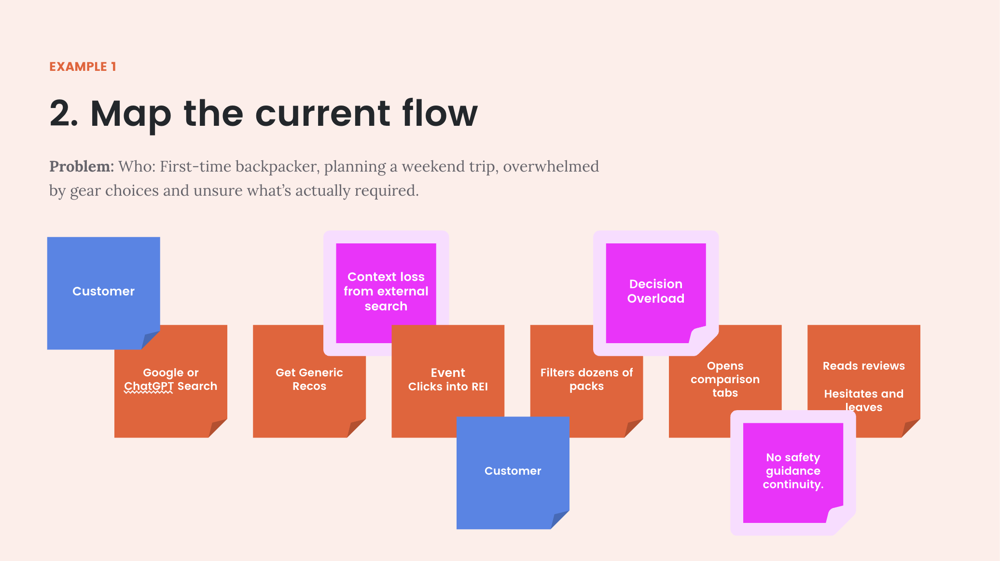
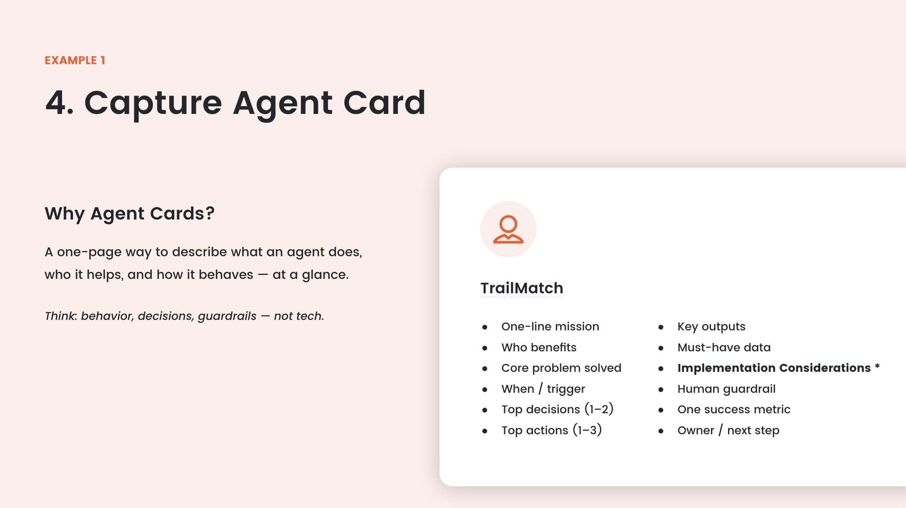
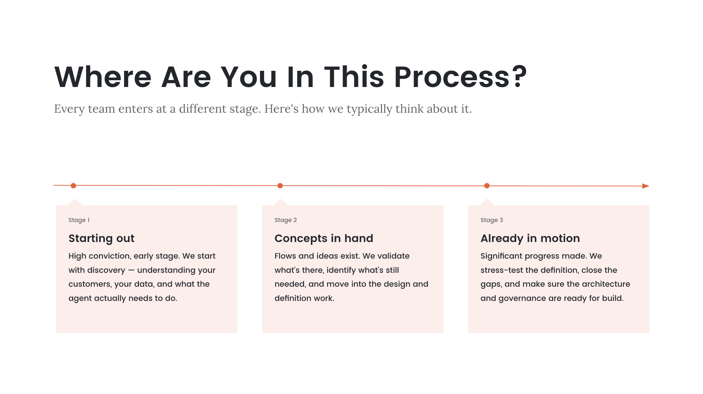

# When UX Becomes AX: How Designers Adapt in the Age of Agentic Systems

I keep hearing this from designers I work with: "Now it's about agents, orchestration, automation — this isn't really design anymore."

## From Screens to Systems

In an Agentic Experience Studio I defined and ran, we designed what an agent is allowed to decide, when it should act, when it shouldn't, how it signals confidence, where humans approve or override, and what success and failure actually look like. The boundary conditions of autonomous work, not its interface.

UX has always been about systems; we just focused mostly on the visible layer. Now the invisible layer matters just as much: how work flows across tools, where decisions bottleneck, where coordination breaks down, and where trust erodes. Designing agents means designing behavior inside those systems. When systems can act autonomously, the cost of bad decision design is higher than the cost of bad visual design.

*Swimlane mapping: exposing where decisions stall, where coordination breaks, and where trust erodes across the real workflow.*

## The Skills Already Transfer

Designers already frame ambiguous problems, make invisible systems visible, and align teams across disciplines. In the workshop, that's what we were doing. Nobody debated models or APIs. The room was full of people clarifying decisions, defining guardrails, and agreeing on who owns what. The tools were new. The instincts were familiar.

## Designing Autonomy in Practice

The workshop combined lightweight process mapping, inspired by event storming, with design studio sketching. We mapped real workflows across customer, system, ops, and engineering lanes, identified where decisions stall or break, and then translated that into agent behavior using simple agent cards.

Each card captured:

- a mission and trigger
- the decisions the agent would make
- the actions it would take
- guardrails constraining it
- human oversight moments
- a success metric
- an owner

*The agent card: one page that forces a team to define what the agent decides, what it does, who oversees it, and how you know if it worked.*

## The Shift

Halfway through the session, the question shifted. We stopped designing what the agent should do and started mapping what the organization needed in place before any agent could work: data availability, decision ownership, handoff definitions, and how to know if any of it was actually working.

We also had to consider how transparent the experience should be about what the customer is actually talking to. The closer an agent gets to feeling human without quite arriving, the more the gap unsettles people. Honesty about the interaction turned out to be a design decision, not a disclosure requirement.

That reframe changed the rest of the session. Less feature ideation, more readiness and alignment, more grounded conversations about what was actually buildable.

## Where Design Becomes Strategy

The hardest part for teams isn't generating AI ideas. It's deciding what should be automated, what shouldn't, who owns it, and how you measure whether it worked.

Running these workshops taught me that the real deliverable isn't a prototype. It's a build-ready definition of behavior and system requirements. That learning led to defining a repeatable Align phase in two halves:

**Kickoff & Discovery** — understand goals and stakeholders, map customer jobs and journeys, surface data and content gaps, assess technology and platform readiness.

**Solution Design & Prioritization** — define the experience and conversation flows, build the decision and context model, lock down data and content requirements, draft the technical blueprint, and establish measurement and governance.

The other thing the workshops made clear is that teams arrive at different stages of readiness. Some have high conviction but no definition. Others have flows and concepts already built. The process had to account for that, so teams could see themselves in it and we could meet them where they are.

*Every team enters at a different stage. The Align phase flexes to meet them where they are.*

The output is something an engineering team can build against, not a deck.

## Why I'm Optimistic

The workshops didn't require data science or model architecture. They required framing problems, surfacing tradeoffs, making invisible things visible, and keeping humans in control. Designers already do that work. The surface area is changing, but the core discipline holds.
