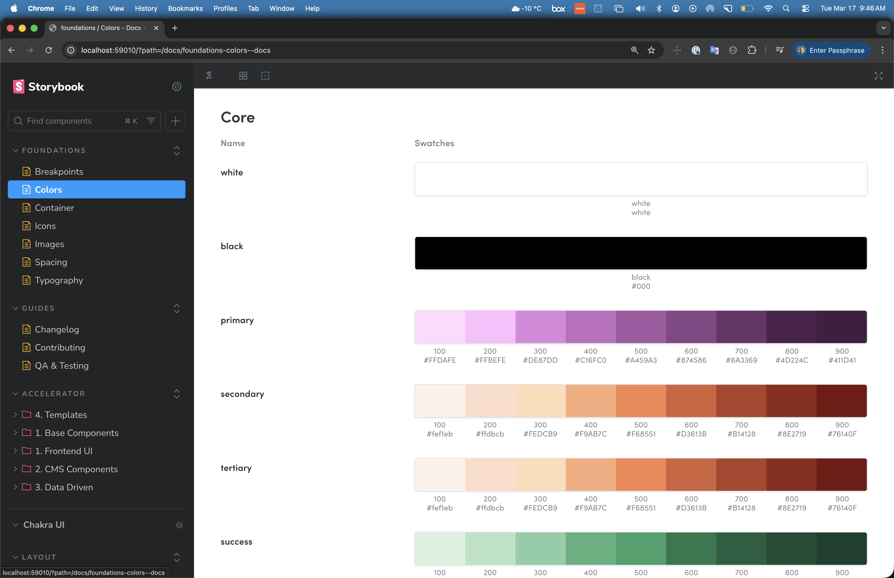
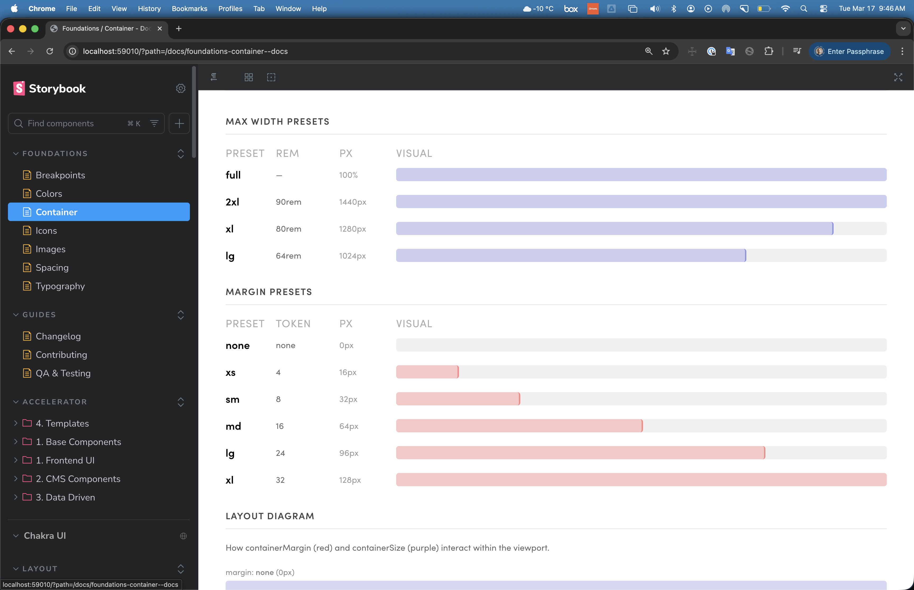
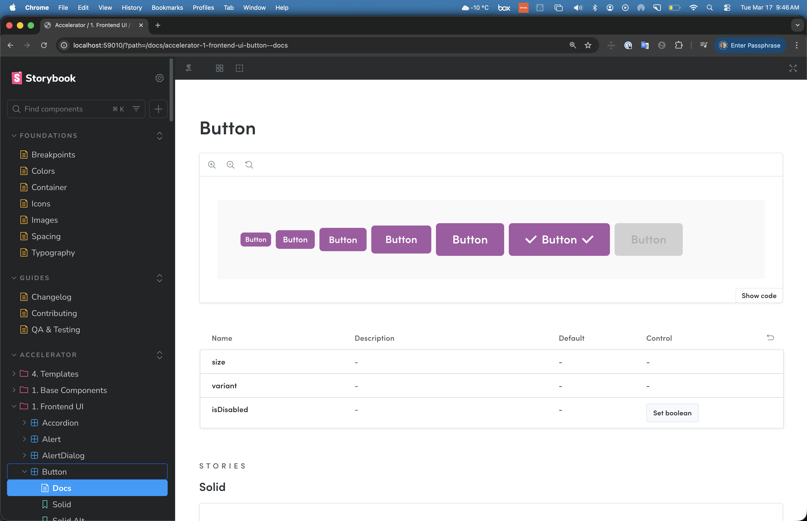
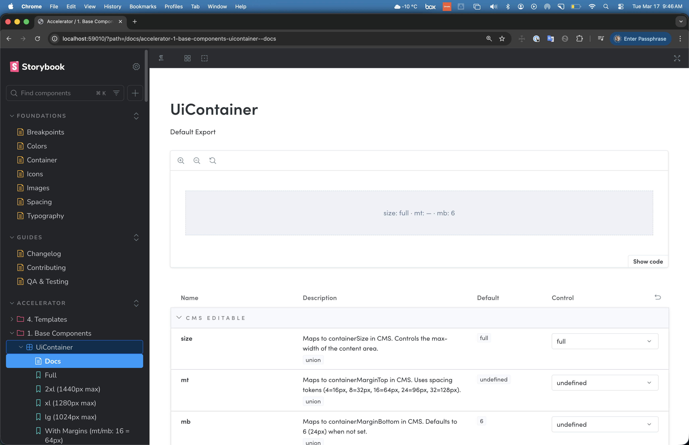
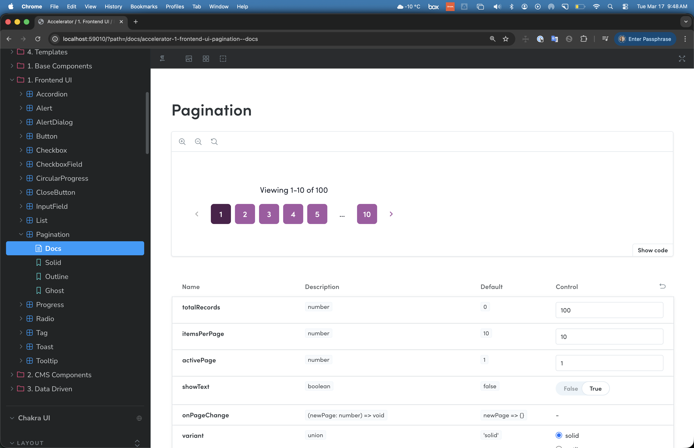
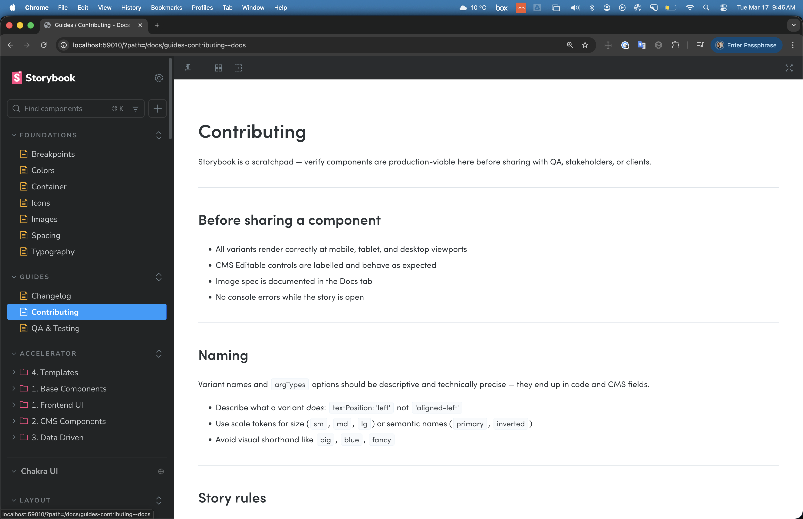

# The /design Agent
An isolated Storybook environment powered by AI. One command to start.

| | |
|---|---|
| **Role** | Design Lead · Design Engineer |
| **Client** | Internal / Orium |
| **Status** | In Progress · 2024 |
| **Tags** | design-engineering · storybook · ai |

## Key Learning

In a service company, clients have existing teams and established workflows. The design challenge is making handoff precise enough to be useful, and someone has to build the infrastructure before the team decides to adopt it.

## Overview

In client work, the gap between design intent and production reality lives in interpretation. The only way to close it is to give designers access to the real environment, not a simulation of it.

I tried Storybook as a shared environment early on. The idea was right; the structure wasn't. Merge conflicts, blocked PRs, unclear ownership: neither side had a clean working context. This project is the rethink: an isolated environment per client, one command to spin up, connected to the same components and tokens as production but completely independent from the dev repo.

## The Constraint

The design environment and the dev environment need to share a source of truth, but in client delivery work, they can't share a codebase.

When designers join the dev repo, they create friction at the point where development velocity matters most. A fully separate environment risks drift. If the two codebases diverge, design intent no longer maps to production reality. The constraint was building isolation without disconnection.

## Approach

### One command, isolated from dev

`/design setup acme-retail` scaffolds a complete workspace: real production UI components, live token pages that hot-reload from JSON, full-width page templates. The repo is separate from the dev codebase. Designers have a full working context without touching anything that could block a PR or create a review bottleneck.

### Token sync without custom tooling

Token Studio compatibility is built in. The `.env.tokens` config mirrors Figma's Token Studio GitHub sync settings exactly, so the token repo is the bridge between Figma variables and what renders in Storybook. Updating a token in Figma propagates to the design workspace on the next sync, with no manual export or file copying.

### Diff-based handoff

When work is ready to hand off, `/design diff` outputs a structured change list: specific files, specific properties, specific values. Developers action it as a PR. Nothing auto-applies; developers control what merges. The handoff artifact is concrete rather than interpretive.


*The /design command suite: seven commands covering setup, sync, diff, push, and screenshot capture.*


*Foundations: color tokens rendered as living swatches, primary, secondary, tertiary, and semantic scales with hex values.*


*Foundations: container presets with visual bars showing max-width and margin at each breakpoint, token values mapped to layout behaviour.*


*A component in the isolated workspace: all variants rendered live, props table with controls, stories for each state.*

## Outcome

The full command suite runs on real client projects today:

```bash
/design setup acme-retail      # scaffold isolated workspace
/design add [ComponentName]    # add component stories
/design sync                   # pull latest tokens + components
/design diff                   # output change list for dev PR
/design push                   # push token updates
/design screenshots [--filter] # capture full-page screenshots
/design watch                  # hot-reload on token changes
```

| Design action | Dev artifact |
|---|---|
| `/design diff` | PR with specific file changes |
| Token edits + `/design push` | Theme updates in production |
| `/design screenshots` | Client feedback in Miro |
| Proposed variants | CMS schema discussion |

Designers work in real components against real tokens, with no risk of blocking the dev team. Client feedback happens in Miro from full-page screenshots rather than Figma approximations. The handoff artifact is a structured diff: specific files, specific changes, not a document of annotations someone has to interpret.


*UiContainer with CMS-editable props (size, margin-top, margin-bottom), each mapped to spacing tokens. This is what "connected to production" means: props that match CMS fields exactly.*


*Pagination with three variants, live controls, and prop descriptions, used by QA and developers to verify behaviour before it hits a CMS environment.*


*The Contributing guide inside the workspace: naming conventions, story rules, and the checklist for sharing a component with QA or a client.*

## What I Learned

Building the infrastructure before the team adopts it is a deliberate choice. The environment has to exist before anyone can experience it.

The technical side is solved. Getting a team with established delivery habits to change how they work is slower and not something you can engineer around. Adoption follows evidence, not argument. The designers who've worked inside the environment understand it immediately. The challenge is creating enough of those moments that it stops being something one person uses.
