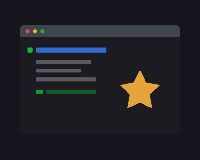
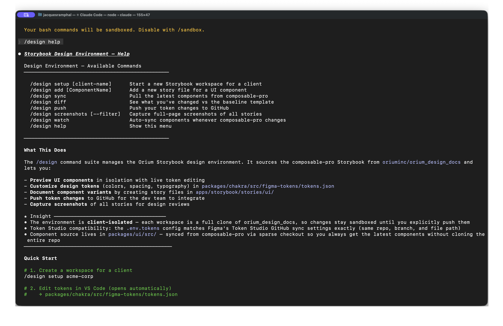

# Collapsing the Handoff Gap

#### A Storybook design environment powered by AI — one command to start.

<br>



## The Problem

We tried Storybook as a shared environment — same repository, both design and development contributing. The idea was right. The process around it wasn't mature enough: merge conflicts, blocked PRs, unclear ownership. It created friction for everyone and didn't stick.

AI-assisted tooling changes the frame. Designers can work *in* the product rather than alongside it — real components, real tokens, real layouts that behave like production. The gap where interpretation happens is where things go wrong, and a shared working environment is still the right answer. It just needs the right structure.

## What I Built

A design layer on top of an existing agentic development framework. In practice: a set of AI-powered commands, a design agent, and an isolated Storybook environment that a designer can spin up with one command.

```bash
/design setup acme-retail
```

That scaffolds a complete design environment — real production UI components, live token pages that hot-reload from a JSON source, full-width page templates, and editor links from every editable block. It lives in its own repository, separate from the dev codebase, with minimal dependencies so it's easy to spin up per project.

The full command suite:

```
/design setup [client-name]     Start a new Storybook workspace for a client
/design add [ComponentName]     Add a new story file for a UI component
/design sync                    Pull the latest components from composable-pro
/design diff                    See what you've changed vs the baseline template
/design push                    Push your token changes to GitHub
/design screenshots [--filter]  Capture full-page screenshots of all stories
/design watch                   Auto-sync components whenever composable-pro changes
```

Each workspace is a full clone of the design system, so changes stay sandboxed until you explicitly push them. Token Studio compatibility is built in — the `.env.tokens` config matches Figma's Token Studio GitHub sync settings exactly (same repo, branch, and file path), so there's no manual wiring.




## How It Connects to Developer Workflows

Isolation is the point. Designers work in their own repo — connected to the same components and tokens as production, but completely independent from the dev workflow. No merge conflicts. No blocked PRs. No one waiting on anyone else.

The connection points are explicit rather than implicit:

| Design output | Dev input |
|---------------|-----------|
| `/design diff` change list | PR with specific file changes |
| Token edits in `tokens.json` | Theme updates via existing token pipeline |
| Screenshots in `screenshots/` | Client feedback in Miro/Figma |
| Proposed story variants | CMS schema discussion, not a blocker |

When a designer is ready to hand off, `/design diff` outputs a structured change list that developers action as a pull request. Nothing auto-applies. Developers stay in control of what merges. The handoff is concrete, not a PDF of annotations.

## What This Unlocks

- **UX baseline polishing** — Nail spacing, states, and responsive behavior directly in real components before dev picks it up. Catch the drift early.
- **Rapid prototyping** — Test ideas against actual component behavior, not Figma's approximation of it.
- **Design audits** — Surface drift between design intent and production reality in the actual environment, not a separate review tool.
- **Client sharing** — Full-page screenshot capture for Miro and Figma reviews, without Figma needing to be the source of truth.

## Key Principles

- **Isolation for safety** — Design environments separate from dev repos eliminate conflict without eliminating connection.
- **Shared source of truth** — Same components, same tokens, different working environments.
- **Structured handoff** — Diffs replace interpretive specs. Developers review changes, not someone's annotations.
- **One command to start** — Low friction entry, expandable as the workflow matures.
- **Built on shared infrastructure** — The design layer extends an org-wide agentic framework rather than introducing a parallel tool.

## Building Ahead of the Team

This is a working system, not a shipped product. The `/design` environment runs today — real components, real tokens, real handoffs. What isn't resolved is the organizational side: how this becomes a team practice rather than something one person uses.

That's intentional. Infrastructure should exist before there's consensus about using it. Someone has to build the bridge before the team decides to cross it.

The harder problem now isn't implementation — it's adoption. Introducing a new way of working to a team with existing habits, existing tools, and reasonable skepticism about adding complexity.
