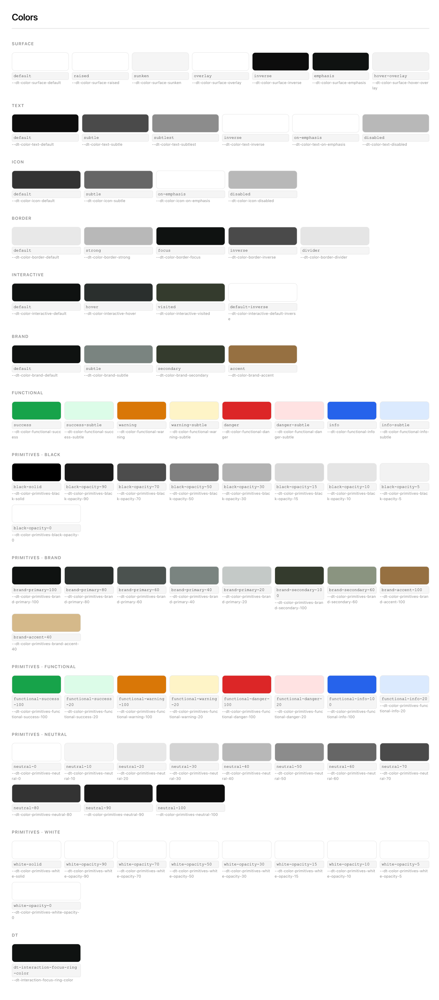
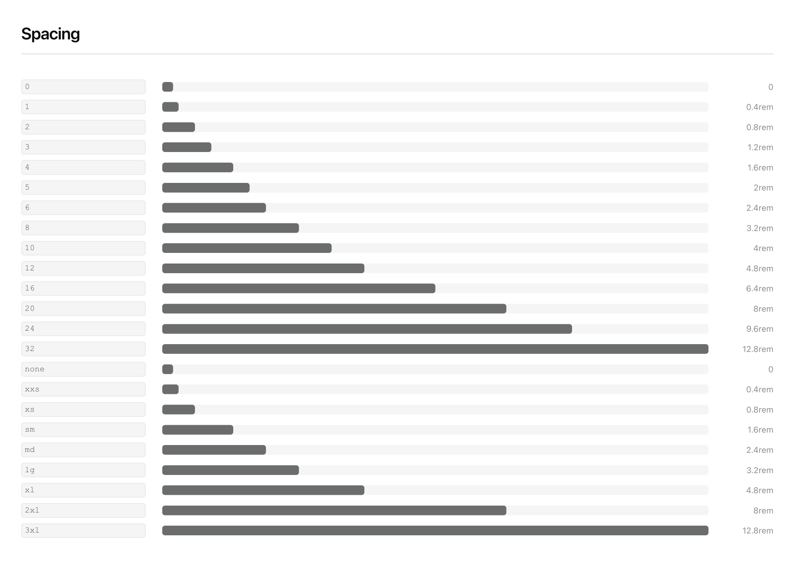
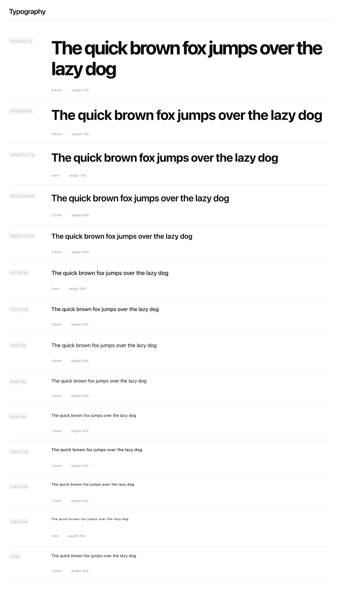
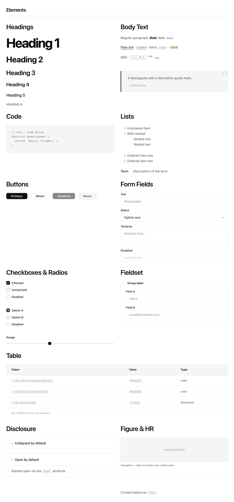

# Design Token Starter
A reusable foundation for design systems — multi-brand, theme-aware, and accessible by default.

| | |
|---|---|
| **Role** | Author |
| **Type** | Open Source |
| **Status** | Active · 2025 |
| **Tags** | design-systems · tokens · open-source |

## Key Learning

The decisions that feel like overhead at the start of a project — multi-brand support, dark mode, accessible defaults — are the ones that become expensive refactors when deferred. Doing them right once in a starter means every project that uses it starts from a better baseline.

## Overview

Every project that involves a design system eventually hits the same moments: a second brand shows up, dark mode gets requested, someone asks if it's accessible. Each one can feel like a detour, something to handle after the real work is done. This starter treats those things as the foundation rather than the afterthought.

Two files to import. An unstyled HTML document looks designed. Multi-brand and dark mode are built in.

## My Role

I designed the token architecture, wrote the build config, and built the element defaults. This grew from a pattern I kept rebuilding on projects — each time slightly better, until it made sense to make it portable and stop rebuilding it.

## The Constraint

In client and personal projects alike, the design system decisions that seem like they can wait usually can't. A second brand gets added. Dark mode becomes a requirement. Someone discovers the forms aren't accessible. At that point, the token system has to be refactored around decisions it was never designed to accommodate, and that work lands at the worst possible time.

The question this repo tries to answer is: what if those decisions were already made when you started?

## Approach

### Multi-brand from the start

Multi-brand support almost always arrives late, either as a client request after launch or as an architectural call that gets deferred to the dev team. The result is usually the same: a refactor of something that should have been part of the foundation.

The starter includes two working brands to demonstrate the pattern. Each brand is a single file containing only what differs from the shared base. Adding a third brand means copying a template file, adding color and font overrides, and registering it in two places. The complexity doesn't grow with the number of brands.

### Theme-aware, not theme-bolted-on

Dark mode added late usually means writing override blocks after the fact and hoping nothing breaks. When theming is part of the token architecture from the start, switching themes is an attribute on the root HTML element, and every surface, text color, and border updates automatically.

The key is the semantic layer. A token like `--dt-color-surface-default` changes meaning based on the active theme; a hardcoded hex value doesn't. Light and dark themes live in their own files, same keys, different references to the primitive layer underneath.

### Base styles for HTML elements

Starting a new project without a style baseline means spending the first few hours making headings look right, remembering to style fieldsets, and finding out you forgot `details/summary` when someone actually uses it. Base styles are always eventually written; they're just usually written inconsistently and incomplete.

The base stylesheet covers the full set of HTML elements using only token references. Two imports and the defaults are already there, coherent and token-driven.

### Accessible by default

Accessibility tends to get treated as an audit item or a late-stage check, when most of the foundational work is actually in the defaults. Focus rings need to be visible. Color contrast needs to pass. Form elements need to behave as expected. These aren't hard decisions — they're just easy to skip when moving fast.

Building them into the base styles means they carry into every project that uses the starter, without anyone having to think about them again.


*The semantic color layer. Role-based aliases like `--dt-color-surface-default` carry the theming and accessibility decisions — contrast, focus ring colors, surface roles — that would otherwise need to be re-established per project.*


*Spacing with both numeric keys and semantic aliases. The same scale, two ways to reference it depending on context.*


*The typescale covers everything from marketing display text down to label and caption sizes.*

## Outcome

Import two files, get a styled document. Switch brands or themes with a single HTML attribute, no rebuild required.

```html
<html data-brand="serif" data-theme="dark">
```

The build runs on Style Dictionary v4 with Token Studio transforms, outputs CSS, JS, and JSON, and syncs with Figma through Token Studio's `$themes.json`. Running `npm run preview` generates a full token reference in TOKENS.md.


*`base.css` element defaults. Every HTML element styled through tokens, including the ones that get forgotten until someone needs them.*

## What I Learned

Every project that uses this starts with multi-brand scaffolding, accessible defaults, and a working theme system already in place. The overhead of those decisions is gone before the first line of product code is written.

The things that get deferred in a hurry — theming, accessibility, multi-brand structure — aren't actually that hard to build. They're just easy to skip. A starter that makes them the default removes the moment where you have to decide whether to do them properly or cut the corner.

Source and template on [GitHub](https://github.com/jacquesramphal/design-token-template)
