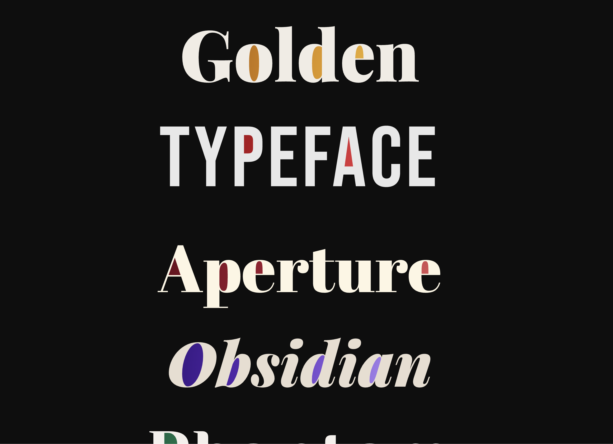

# Counter Fill: Colouring the Holes in Your Type

Fills the enclosed spaces inside letterforms — the holes in **o, e, a, g, d, b, p** — with colour or gradient. Live HTML text, any font, any size.




## Small detail. Real problem.

The counter is one of the oldest details in type design. It's the enclosed space inside a letterform: the bowl of an **o**, the eye of an **e**, the aperture of a **p**. Type designers have shaped and tuned these spaces for centuries. They carry weight, personality, and optical balance. In display type especially, they're hard to ignore.

In print and in every design tool, filling a counter with a different colour is nothing. You paint it. Designers do it constantly in editorial mastheads, logotypes, posters, anywhere display type gets treated as image.

In the browser, on live text, nobody had done it. Not that I could find.

That gap is invisible if you're only on one side of the design-dev divide. Designers don't know what it takes to replicate it in code. Developers don't think about letterform counters. I noticed it because I'm on both sides, and the absence was obvious.


## Overview

I searched for a while. There are workarounds — SVG paths drawn by hand, blend mode effects that only hold under narrow conditions — but nothing that works on real live text, at any size, in any font, without throwing away accessibility in the process.

So I built it.

The text stays real: selectable, readable by screen readers, searchable. The colour is purely decorative, sitting behind the letterforms, invisible to anything that isn't looking at pixels.


## Demo

### Display type

<iframe height="700" style="width:100%;border:0;border-radius:8px;" scrolling="no" src="https://codepen.io/jacquesramphal/embed/019d6a8b-f8b2-7211-a1f0-6497fa65c2d4?default-tab=result" loading="lazy" allowfullscreen="true"></iframe>

### Variable fonts

<iframe height="700" style="width:100%;border:0;border-radius:8px;" scrolling="no" src="https://codepen.io/jacquesramphal/embed/019d6a98-6565-7819-a86b-c9157ef62c55?default-tab=result" loading="lazy" allowfullscreen="true"></iframe>

## Usage

Required CSS is injected automatically — no stylesheet needed.

### Single-line

```html
<h1 class="wrap" id="w1">
  <canvas></canvas>
  <span class="text">Golden</span>
</h1>

<script src="counter-fill.js"></script>
<script>
  document.fonts.ready.then(() => {
    CounterFill.init({
      w1: { stops: ['#f5c842', '#d4820a', '#7a3a08'] },
    });
  });
</script>
```

### Multi-line

Just write the text. JS splits words automatically.

```html
<h2 class="wrap-multi" id="wm">Golden Baroque Obsidian</h2>

<script>
  document.fonts.ready.then(() => {
    CounterFill.init({
      wm: { stops: ['#f5c842', '#d4820a'] },
    });
  });
</script>
```

### Colours

Keyed by element `id`. Two or more stops become a radial gradient, centre-out. One stop is a solid fill. CSS variables work directly.

```js
CounterFill.init({
  w1: { stops: ['#f5c842', '#d4820a', '#7a3a08'] }, // 3-stop gradient
  w2: { stops: ['#60c8f0', '#002060'] },             // 2-stop
  w3: { stops: ['#e05c5c'] },                        // solid
  w4: { stops: ['var(--color-accent)'] },            // design token
});
```

For Vue, React, and module setups, see the [full README on GitHub](https://github.com/jacquesramphal/jacquesramphal.github.io/tree/main/packages/counter-fill).


## What I learned

The gap between "this seems like a small detail" and "this took significant effort to get right" is almost entirely about making two systems agree on where the text actually is. That part took longer than everything else combined.

Worth it for any project where typography is doing serious work.
