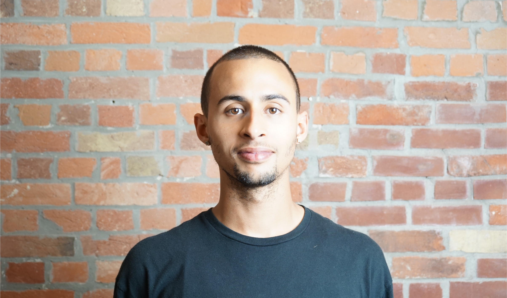

# Thirteen years at the seam between design and engineering

Toronto. Designing systems, writing production code, and building with AI.

I care most about the gap between design intent and what actually ships. Not just how things look, but how decisions survive handoff, how systems scale across teams and brands, and how people stay in control when the tools get smarter.

I led the design of [Genie](/doc/designing-genie), an agentic AI platform built to automate the mechanical parts of delivery work so designers can spend their energy on what actually requires judgment. Building it changed how I work. I went in as a designer and came out also an AI developer, a workflow orchestration practitioner, and a reluctant product thinker. I'm still mostly a designer.

I write production front-end code, run design QA, and pair with engineers on implementation because I've seen too many good decisions die in handoff. I also coach designers who want to move closer to systems and code, not because everyone needs to write code, but because fluency removes friction and changes the kinds of conversations you can have.

I maintain a set of [open-source tools](/library) and write about design, AI, and the places they intersect.

---

- [Ask me anything](/doc/ask-me-anything)
- [Journal](/doc/design-learnings)
- [Library](/library)
- [Colophon](/doc/colophon)
- [GitHub](https://github.com/jacquesramphal)
- [Email](mailto:jacques@ramphal.design)
